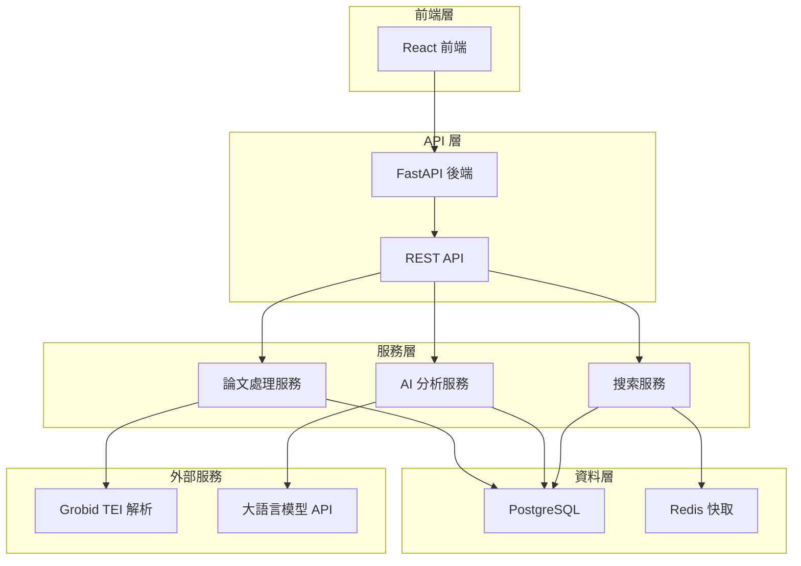
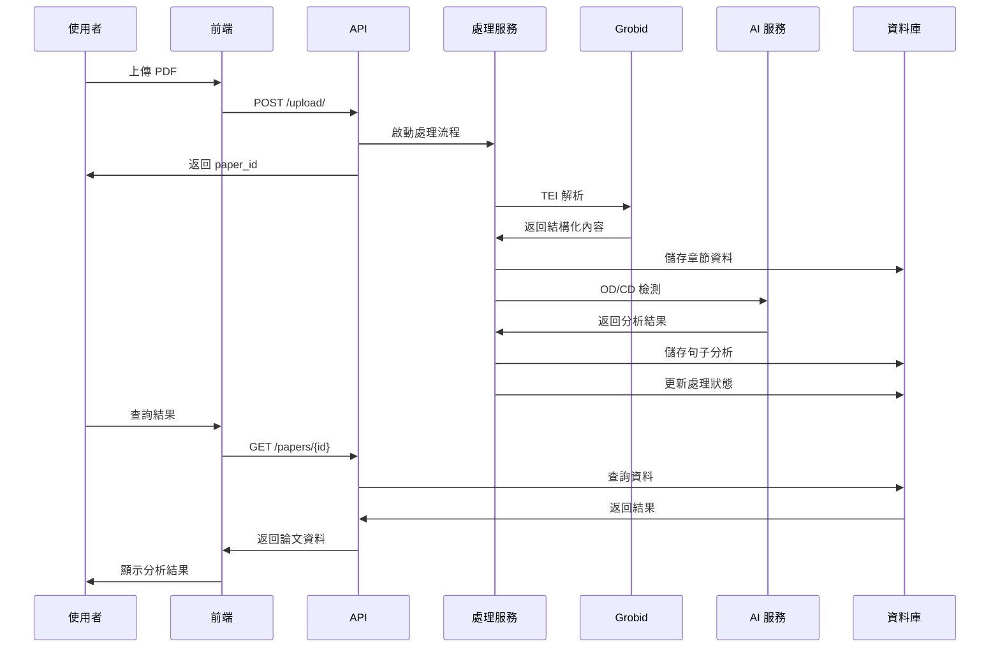

# 論文分析系統文檔

## 系統概述

論文分析系統是一個基於 AI 的學術論文自動分析平台，能夠自動提取和分析論文中的研究目標定義（Objective Definition, OD）、資料集定義（Dataset Definition, CD）和貢獻定義（Contribution Definition）。

### 主要功能

- **PDF 論文上傳與解析**: 支援 PDF 格式論文上傳，使用 Grobid 進行結構化解析
- **智能章節分析**: 自動識別論文章節（摘要、介紹、方法論、結果、結論等）
- **句子級別分析**: 提取並分析每個句子，識別其中的關鍵定義
- **AI 驅動檢測**: 使用大語言模型檢測 OD、CD 和貢獻定義
- **全文搜索**: 支援跨論文的關鍵詞搜索和語義搜索
- **統計分析**: 提供詳細的統計資訊和分析報告

### 技術架構

- **後端**: FastAPI (Python)
- **資料庫**: PostgreSQL 15.13
- **前端**: React
- **容器化**: Docker & Docker Compose
- **PDF 處理**: Grobid TEI 解析
- **AI 模型**: 大語言模型 API 整合
- **快取**: Redis

## 文檔導航

### 📋 核心文檔

| 文檔 | 描述 | 適用對象 |
|------|------|----------|
| [資料庫 Schema](database_schema.md) | 完整的資料庫結構文檔，包含所有表格、欄位、關係和約束 | 開發者、DBA |
| [資料庫 ER 圖](database_er_diagram.md) | 實體關係圖和資料庫設計說明 | 開發者、架構師 |
| [API 文檔](api_documentation.md) | 完整的 REST API 文檔，包含所有端點和使用範例 | 前端開發者、API 使用者 |

### 🏗️ 系統架構



### 📊 資料流程



## 快速開始

### 1. 環境要求

- Docker & Docker Compose
- Python 3.9+
- Node.js 16+
- PostgreSQL 15+

### 2. 啟動系統

```bash
# 克隆專案
git clone <repository-url>
cd pure_front

# 啟動所有服務
docker-compose up -d

# 檢查服務狀態
docker-compose ps
```

### 3. 驗證安裝

```bash
# 檢查 API 健康狀態
curl http://localhost:8000/health

# 檢查前端
open http://localhost:3000

# 檢查資料庫連接
docker-compose exec paper_analysis_db psql -U postgres -d paper_analysis -c "\dt"
```

### 4. 上傳第一個論文

```bash
# 使用 curl 上傳 PDF
curl -X POST "http://localhost:8000/api/upload/" \
     -H "accept: application/json" \
     -H "Content-Type: multipart/form-data" \
     -F "file=@your_paper.pdf"
```

## 開發指南

### 資料庫操作

```sql
-- 查看論文處理狀態
SELECT id, file_name, processing_status, 
       grobid_processed, sentences_processed, od_cd_processed
FROM papers 
ORDER BY created_at DESC;

-- 查看句子分析結果
SELECT p.file_name, s.content, s.has_objective, s.has_dataset, s.has_contribution
FROM sentences s
JOIN papers p ON s.paper_id = p.id
WHERE s.has_objective = true OR s.has_dataset = true OR s.has_contribution = true;
```

### API 使用範例

```python
import requests

# 上傳論文
with open('paper.pdf', 'rb') as f:
    response = requests.post('http://localhost:8000/api/upload/', 
                           files={'file': f})
paper_id = response.json()['paper_id']

# 查詢處理狀態
status = requests.get(f'http://localhost:8000/api/papers/{paper_id}/status')
print(status.json())

# 搜索句子
results = requests.get('http://localhost:8000/api/sentences/search', 
                      params={'q': 'machine learning'})
print(f"找到 {results.json()['total']} 個相關句子")
```

## 系統監控

### 容器狀態監控

```bash
# 查看所有容器狀態
docker-compose ps

# 查看容器日誌
docker-compose logs -f paper_analysis_backend
docker-compose logs -f paper_analysis_db

# 查看資源使用情況
docker stats
```

### 資料庫監控

```sql
-- 查看表格大小
SELECT 
    tablename,
    pg_size_pretty(pg_total_relation_size(tablename::regclass)) AS size
FROM pg_tables
WHERE schemaname = 'public'
ORDER BY pg_total_relation_size(tablename::regclass) DESC;

-- 查看處理統計
SELECT 
    processing_status,
    COUNT(*) as count,
    AVG(EXTRACT(EPOCH FROM (processing_completed_at - upload_timestamp))) as avg_processing_time
FROM papers 
WHERE processing_completed_at IS NOT NULL
GROUP BY processing_status;
```

### API 效能監控

```bash
# 測試 API 響應時間
curl -w "@curl-format.txt" -o /dev/null -s "http://localhost:8000/api/papers/"

# 批量測試
for i in {1..10}; do
    curl -w "%{time_total}\n" -o /dev/null -s "http://localhost:8000/api/papers/"
done
```

## 故障排除

### 常見問題

1. **容器啟動失敗**
   ```bash
   # 檢查端口占用
   lsof -i :8000
   lsof -i :3000
   lsof -i :5432
   
   # 重新構建容器
   docker-compose down
   docker-compose build --no-cache
   docker-compose up -d
   ```

2. **資料庫連接問題**
   ```bash
   # 檢查資料庫容器
   docker-compose logs paper_analysis_db
   
   # 手動連接測試
   docker-compose exec paper_analysis_db psql -U postgres -d paper_analysis
   ```

3. **處理卡住**
   ```sql
   -- 查看處理佇列
   SELECT * FROM processing_queue WHERE status = 'processing';
   
   -- 重置卡住的任務
   UPDATE processing_queue 
   SET status = 'failed', error_message = 'Manual reset'
   WHERE status = 'processing' 
   AND started_at < NOW() - INTERVAL '1 hour';
   ```

### 日誌分析

```bash
# 查看後端日誌
docker-compose logs -f --tail=100 paper_analysis_backend

# 查看特定錯誤
docker-compose logs paper_analysis_backend | grep ERROR

# 查看處理進度
docker-compose logs paper_analysis_backend | grep "Processing"
```

## 維護指南

### 定期維護任務

1. **資料庫清理**
   ```sql
   -- 清理超過 30 天的錯誤記錄
   DELETE FROM processing_queue 
   WHERE status = 'failed' 
   AND created_at < NOW() - INTERVAL '30 days';
   ```

2. **日誌輪轉**
   ```bash
   # 清理 Docker 日誌
   docker system prune -f
   docker volume prune -f
   ```

3. **備份資料庫**
   ```bash
   # 創建備份
   docker-compose exec paper_analysis_db pg_dump -U postgres paper_analysis > backup_$(date +%Y%m%d).sql
   
   # 還原備份
   docker-compose exec -T paper_analysis_db psql -U postgres paper_analysis < backup_20250114.sql
   ```

### 效能優化

1. **資料庫索引優化**
   ```sql
   -- 分析查詢效能
   EXPLAIN ANALYZE SELECT * FROM sentences WHERE has_objective = true;
   
   -- 重建索引
   REINDEX INDEX idx_sentences_has_objective;
   ```

2. **快取策略**
   ```bash
   # 檢查 Redis 使用情況
   docker-compose exec pdf-splitter-redis redis-cli info memory
   
   # 清理快取
   docker-compose exec pdf-splitter-redis redis-cli flushall
   ```

## 版本資訊

- **系統版本**: 1.0.0
- **資料庫版本**: PostgreSQL 15.13
- **API 版本**: v1
- **最後更新**: 2025-01-14

## 貢獻指南

1. Fork 專案
2. 創建功能分支 (`git checkout -b feature/amazing-feature`)
3. 提交變更 (`git commit -m 'Add amazing feature'`)
4. 推送到分支 (`git push origin feature/amazing-feature`)
5. 開啟 Pull Request

## 授權

本專案採用 MIT 授權條款。詳見 [LICENSE](../LICENSE) 檔案。

## 聯絡資訊

- **專案維護者**: [維護者姓名]
- **Email**: [email@example.com]
- **問題回報**: [GitHub Issues](https://github.com/your-repo/issues)

---

📚 **更多文檔**: 
- [資料庫 Schema 詳細說明](database_schema.md)
- [API 完整文檔](api_documentation.md)
- [資料庫 ER 圖](database_er_diagram.md) 