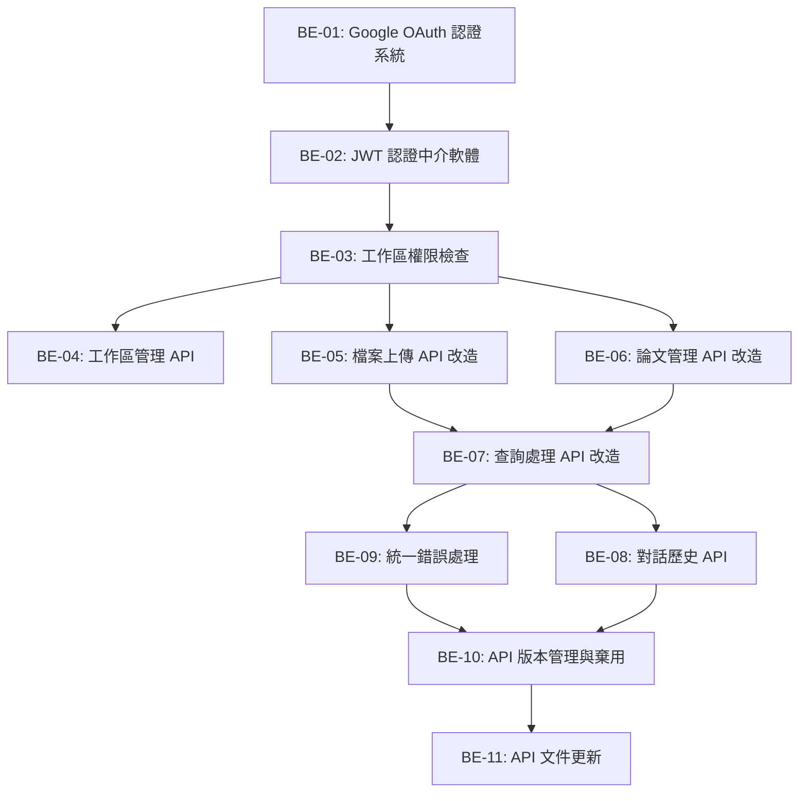

# 後端 API 改造 - Backlog 總覽

## Epic: 從匿名系統轉為多使用者工作區 API 架構

### 階段目標

將現有的匿名、全域共享 API 系統，改造為支援 Google OAuth 2.0 認證與多工作區隔離的個人化 API 架構。

### 核心挑戰與策略

#### **認證與授權 (Authentication & Authorization)**
- **現況**: 無認證機制，所有 API 開放存取
- **目標**: Google OAuth 2.0 + JWT 認證，工作區級別的資料隔離
- **策略**: 漸進式遷移，支援向後相容性

#### **API 端點重構 (API Endpoint Refactoring)**  
- **現況**: 全域資料操作 (e.g., `GET /papers/`)
- **目標**: 工作區限定操作 (e.g., `GET /workspaces/{workspace_id}/papers/`)
- **策略**: 新舊 API 並存，逐步棄用舊端點

#### **中介軟體 (Middleware) 架構**
- **現況**: 無認證檢查，直接資料庫存取
- **目標**: JWT 驗證 + 工作區權限檢查 + 統一錯誤處理
- **策略**: Dependency Injection 模式實作

### 執行順序與依賴關係

### 優先級分組

#### **🔴 Highest Priority (基礎架構)**
- **BE-01**: Google OAuth 2.0 認證系統 `[8 SP]`
- **BE-02**: JWT 認證中介軟體 `[5 SP]`
- **BE-03**: 工作區權限檢查機制 `[5 SP]`

#### **🟡 High Priority (核心功能)**
- **BE-04**: 工作區管理 API `[3 SP]`
- **BE-05**: 檔案上傳 API 改造 `[5 SP]`
- **BE-06**: 論文管理 API 改造 `[8 SP]`
- **BE-07**: 查詢處理 API 改造 `[8 SP]`
- **BE-08**: 對話歷史 API `[5 SP]`

#### **🟢 Medium Priority (品質提升)**
- **BE-09**: 統一錯誤處理與回應格式 `[3 SP]`
- **BE-10**: API 版本管理與舊端點棄用 `[5 SP]`
- **BE-11**: API 文件與測試更新 `[3 SP]`

### Sprint 建議分配

#### **Sprint 1: 認證基礎建設 (18 SP)**
- BE-01: Google OAuth 系統 (8 SP)
- BE-02: JWT 中介軟體 (5 SP)
- BE-03: 工作區權限檢查 (5 SP)

#### **Sprint 2: 工作區與檔案 API (11 SP)**
- BE-04: 工作區管理 API (3 SP)
- BE-05: 檔案上傳 API 改造 (5 SP)
- BE-09: 統一錯誤處理 (3 SP)

#### **Sprint 3: 核心功能 API (16 SP)**
- BE-06: 論文管理 API 改造 (8 SP)
- BE-07: 查詢處理 API 改造 (8 SP)

#### **Sprint 4: 對話與收尾 (13 SP)**
- BE-08: 對話歷史 API (5 SP)
- BE-10: API 版本管理 (5 SP)
- BE-11: 文件更新 (3 SP)

### 技術決策與約束

#### **認證機制**
- **OAuth Provider**: Google OAuth 2.0 (唯一登入方式)
- **Token 管理**: JWT 存儲使用者與當前工作區資訊
- **Session 管理**: Stateless，基於 JWT

#### **API 設計原則**
- **RESTful**: 遵循 REST 設計原則
- **向後相容**: 舊 API 在過渡期內保持可用
- **錯誤處理**: 統一的錯誤回應格式
- **文件化**: 使用 OpenAPI/Swagger 自動生成文件

#### **資料隔離策略**
- **Workspace-Scoped**: 所有資料操作都限定在特定工作區內
- **Permission Check**: 中介軟體層級的權限驗證
- **Fail-Safe**: 預設拒絕存取，明確授權後才允許

### 風險評估與緩解

#### **高風險項目**
- **BE-01**: OAuth 整合複雜度高，需要與 Google API 深度整合
- **BE-06/BE-07**: 現有 API 邏輯複雜，改造風險大

#### **緩解策略**
- 建立完整的測試套件，確保改造過程不破壞現有功能
- 採用 Feature Flag 機制，可隨時回滾到舊 API
- 實作 API 閘道層，支援新舊 API 路由

### 成功標準

#### **功能完整性**
- [ ] 所有現有功能在新架構下正常運作
- [ ] 使用者可透過 Google 帳號登入並管理多個工作區
- [ ] 資料完全隔離，使用者只能存取自己的工作區資料

#### **效能標準**
- [ ] API 回應時間增加不超過 20%
- [ ] 認證檢查開銷控制在 10ms 以內
- [ ] 支援至少 100 個併發使用者

#### **可維護性**
- [ ] 程式碼結構清晰，職責分離
- [ ] 完整的 API 文件與測試覆蓋率 > 80%
- [ ] 錯誤處理統一且訊息明確

---

### 總估算
- **總 Story Points**: 58 SP
- **預估完成時間**: 6-8 週
- **關鍵依賴**: 第一階段資料庫模型必須完成

### 下一步行動
1. 開始 BE-01: 建立 Google OAuth 2.0 認證系統
2. 同步進行 BE-02: 實作 JWT 認證中介軟體
3. 確保每個 Sprint 都有可測試的中間版本 