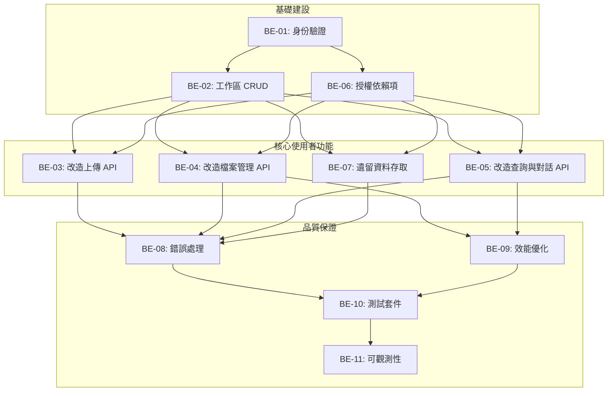

# 後端 API 改造 - Backlog 總覽

## Epic: 會員系統與多工作區功能導入 (後端部分)

### 執行順序與依賴關係

### 優先級與 Sprint 規劃

#### **🔴 Sprint 1: 建立身份與授權基礎 (16 SP)**
- **BE-01: 實現 Google OAuth 與 JWT 身份驗證** `[8 SP, Highest]`
  - *目標：讓使用者可以登入系統。*
- **BE-06: 建立可重用的工作區授權依賴項** `[3 SP, High]`
  - *目標：建立安全的 API 開發模式。*
- **BE-02: 建立工作區管理 (CRUD) API** `[5 SP, High]`
  - *目標：讓使用者可以建立自己的工作空間。*

#### **🟡 Sprint 2: 核心功能工作區化 (18 SP)**
- **BE-03: 改造檔案上傳 API 以支援工作區** `[5 SP, High]`
  - *目標：實現私有檔案上傳。*
- **BE-04: 改造檔案管理 API 以支援工作區** `[5 SP, High]`
  - *目標：實現私有檔案管理。*
- **BE-05: 改造查詢與對話 API 以支援工作區** `[8 SP, High]`
  - *目標：實現私有的 AI 對話與知識庫。*

#### **🟢 Sprint 3: 使用者體驗優化與系統強化 (24 SP)**
- **BE-07: 處理遺留資料存取策略** `[5 SP, High]`
  - *目標：讓新使用者能存取升級前的歷史資料。*
- **BE-08: 實施 API 錯誤處理與回復機制** `[4 SP, High]`
  - *目標：提供友善的錯誤訊息和自動重試機制。*
- **BE-09: 建立 API 效能優化與分頁機制** `[5 SP, Medium]`
  - *目標：確保系統在大量資料下依然順暢。*
- **BE-10: 建立全面的 API 測試套件** `[6 SP, High]`
  - *目標：確保系統的品質和安全性。*
- **BE-11: 可觀測性** `[4 SP, High]`
  - *目標：確保系統的可觀測性和可維護性。*

### API 端點改造前後對照表

| 舊端點 (Before) | 新端點 (After) | 對應 Backlog |
| :--- | :--- | :--- |
| `POST /api/upload` | `POST /api/workspaces/{id}/files` | **BE-03** |
| `GET /api/papers` | `GET /api/workspaces/{id}/files` | **BE-04** |
| `DELETE /api/papers/{pid}` | `DELETE /api/workspaces/{id}/files/{pid}` | **BE-04** |
| `POST /api/papers/select` | `POST /api/workspaces/{id}/selections`| **BE-04** |
| `POST /api/query` | `POST /api/workspaces/{id}/query` | **BE-05** |
| (New) | `GET /api/workspaces/{id}/chats` | **BE-05** |
| (New) | `POST /api/workspaces` | **BE-02** |
| (New) | `GET /api/workspaces` | **BE-02** |
| (New) | `DELETE /api/workspaces/{id}` | **BE-02** |
| (New) | `GET /api/auth/google` | **BE-01** |
| (New) | `GET /api/auth/google/callback`| **BE-01** |

### 總估算
- **總 Story Points**: 58 SP (新增 BE-07 到 BE-11)
- **預估完成時間**: 3-4 個 Sprints (約 6-8 週)
- **關鍵風險**: 
  - 前後端接口的協調與對接。
  - `unified_query_service` 的改造複雜度可能高於預期。
  - OAuth 整合中可能遇到的第三方問題。
  - 遺留資料存取的使用者體驗設計。

---

### 下一步行動
1.  **實施 `BE-01`**，打通登入流程。
2.  **與前端團隊密切溝通**，確認 JWT 的儲存方式 (e.g., `localStorage` or `HttpOnly Cookie`) 和 API 接口格式。
3.  在 Postman 或類似工具中建立測試集，逐一驗證每個新端點的功能與安全性。 