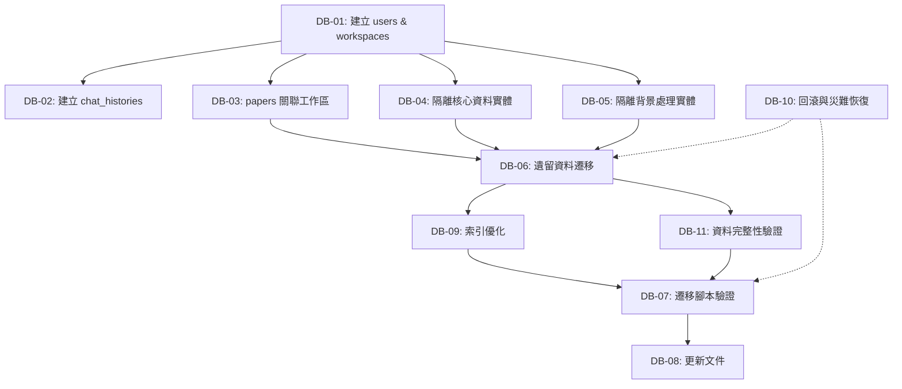

# 資料庫模型重新設計 - Backlog 總覽

## Epic: 會員系統與多工作區功能導入

### 執行順序與依賴關係

### 優先級分組

#### **🔴 Highest Priority (必須最先完成)**
- **DB-01**: 建立使用者與工作區核心表格 `[3 SP]`
- **DB-10**: 建立回滾與災難恢復計畫 `[5 SP]`
- **DB-07**: 驗證資料庫遷移腳本的通用性 `[5 SP]`

#### **🟡 High Priority (核心功能)**
- **DB-02**: 建立對話歷史紀錄表格 `[2 SP]`
- **DB-03**: 將檔案 (papers) 與工作區關聯 `[3 SP]`
- **DB-04**: 隔離核心資料實體 `[5 SP]`
- **DB-06**: 實施遺留資料遷移策略 `[5 SP]`
- **DB-09**: 建立工作區相關索引優化策略 `[3 SP]`
- **DB-11**: 實施資料完整性驗證框架 `[4 SP]`

#### **🟢 Medium Priority (支援功能)**
- **DB-05**: 隔離背景處理相關實體 `[5 SP]`
- **DB-08**: 更新資料庫設計文件 `[3 SP]`

### Sprint 建議分配

#### **Sprint 1: 基礎建設 (13 SP)**
- DB-01 (3 SP)
- DB-10 (5 SP) 
- DB-02 (2 SP)
- DB-03 (3 SP)

#### **Sprint 2: 資料隔離 (10 SP)**
- DB-04 (5 SP)
- DB-05 (5 SP)

#### **Sprint 3: 遷移與優化 (12 SP)**
- DB-06 (5 SP)
- DB-09 (3 SP)
- DB-11 (4 SP)

#### **Sprint 4: 驗證與文件 (8 SP)**
- DB-07 (5 SP)
- DB-08 (3 SP)

### Docker 整合要求

所有 Backlog 都必須滿足以下 Docker 相關需求：

- ✅ 透過 `docker-compose` 建立測試環境
- ✅ 使用 `docker logs` 監控執行進度
- ✅ 支援 `docker-compose exec` 執行驗證腳本
- ✅ 容器化的備份與恢復機制

### 總估算
- **總 Story Points**: 43 SP
- **預估完成時間**: 4-6 週 (根據團隊速度)
- **關鍵風險**: DB-06 (遺留資料遷移) 和 DB-10 (災難恢復)

---

### 下一步行動
1. 開始 DB-01: 建立基礎的 SQLAlchemy 模型
2. 同步進行 DB-10: 建立 Docker 備份與恢復腳本
3. 確保每個 Sprint 結束時都有可部署的版本 