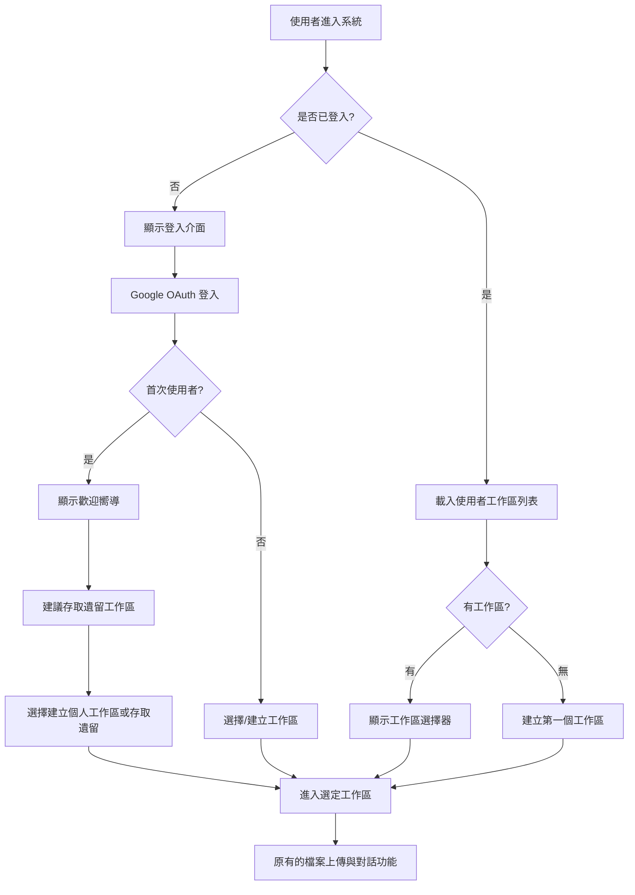

# 前端整合改造 - 規劃總覽

## Epic: 會員系統與多工作區功能導入 (前端部分)

### 階段定位

此階段專注於**前端與新後端 API 的整合**，將現有的單一共享介面改造為支援多使用者、多工作區的個人化平台。

**前置條件：** 
- ✅ 資料庫改造 (DB-01 到 DB-11) 已完成
- ✅ 後端 API 改造 (BE-01 到 BE-10) 已完成

---

### 核心改造策略

#### **🎯 設計哲學：「漸進式增強」**
1. **保持現有使用者體驗**：既有功能的操作流程不變
2. **新增會員功能**：Google 登入 + 工作區選擇機制
3. **向下相容**：提供「訪客模式」存取遺留資料

#### **🔄 使用者流程重新設計**

---

### 主要技術挑戰

#### **🔒 狀態管理重構**
- **舊架構**：全域共享狀態 (單一檔案列表、單一對話歷史)
- **新架構**：工作區範疇狀態 (每個工作區獨立的資料)

#### **🔄 API 客戶端改造**
- 所有 API 調用需要加上 `workspace_id` 路徑參數
- JWT Token 的管理和自動刷新機制
- 錯誤處理的統一化 (特別是授權失敗情況)

#### **💾 本地儲存策略**
- 工作區選擇的記憶功能
- 跨工作區的使用者偏好設定
- 離線模式的考量

---

### 預估規模

#### **開發工作量**
- **前端改造**：約 30-40 Story Points
- **整合測試**：約 10-15 Story Points
- **使用者體驗優化**：約 15-20 Story Points
- **總計**：約 55-75 Story Points

#### **時程預估**
- **前端開發**：4-5 週
- **整合與測試**：2-3 週  
- **使用者驗收與修正**：1-2 週
- **總計**：7-10 週

---

### 關鍵里程碑

#### **🚀 Milestone 1: 基礎整合 (2 週)**
- Google OAuth 登入流程實現
- JWT Token 管理機制建立
- 工作區選擇介面開發

#### **📁 Milestone 2: 核心功能改造 (3 週)**
- 檔案上傳功能工作區化
- 對話介面的工作區隔離
- 狀態管理重構完成

#### **✨ Milestone 3: 使用者體驗優化 (2 週)**
- 遺留資料存取機制
- 歡迎嚮導與使用者引導
- 錯誤處理與友善提示

#### **🔧 Milestone 4: 整合測試與上線 (3 週)**
- 端到端測試套件
- 效能優化與調校
- 生產環境部署

---

### 下一步行動

1. **🎨 UX/UI 設計**：設計工作區選擇介面和歡迎流程
2. **📝 API 規格確認**：與後端團隊確認最終的 API 介面
3. **🧪 技術原型**：建立 Google OAuth 整合的技術原型
4. **📋 前端 Backlog 規劃**：基於此總覽建立詳細的前端 User Stories

---

**📌 注意：** 此文件為高層次規劃，詳細的前端 Backlog 將在後端改造完成後制定。 