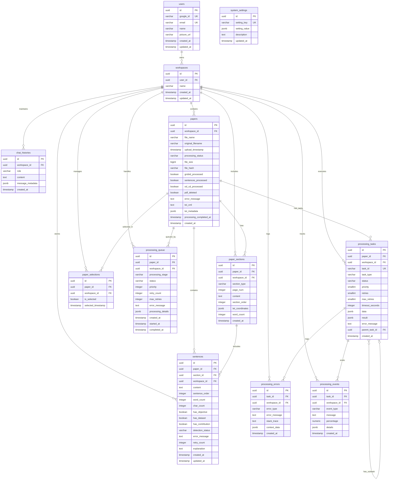

# 資料庫 ER 圖

## 實體關係圖 (Entity Relationship Diagram)

以下是論文分析系統多工作區架構遷移後的完整資料庫實體關係圖（更新日期：2025-01-12）：



## 多工作區架構關係說明

### 🏗️ **核心架構變更 (2025-01-12)**

#### 1. users → workspaces (一對多)
- 一個用戶可以擁有多個工作區，實現多專案管理
- 每個工作區都隸屬於特定用戶，確保資料所有權

#### 2. workspaces → 所有核心實體 (一對多)
- **重大變更**: 所有核心資料實體現在都直接與工作區關聯
- 實現真正的多租戶資料隔離
- 支援同一用戶在不同工作區處理不同專案

### 📄 **論文管理關係**

#### 3. papers → paper_sections (一對多)
- 一篇論文可以有多個章節
- **新增**: 章節現在也直接與工作區關聯，支援跨工作區資料同步檢查

#### 4. papers → sentences (一對多)
- 一篇論文包含多個句子
- **新增**: 句子級別的工作區隔離，支援精細化權限控制

#### 5. paper_sections → sentences (一對多)
- 一個章節包含多個句子
- 保持原有邏輯結構的同時增加工作區一致性檢查

#### 6. papers → paper_selections (一對多)
- **重大變更**: 從一對一改為一對多關係
- 允許同一檔案在不同工作區中有不同的選擇狀態
- `(workspace_id, paper_id)` 複合唯一約束取代原有 `paper_id` 唯一約束

### 🔄 **處理任務關係**

#### 7. papers → processing_queue (一對多)
- 論文處理佇列現在按工作區隔離
- 支援不同工作區的獨立處理優先級設定

#### 8. processing_tasks → processing_errors/events (一對多)
- 處理任務的錯誤和事件記錄現在也按工作區隔離
- 便於按工作區進行問題排查和效能分析

### 💬 **對話歷史關係**

#### 9. workspaces → chat_histories (一對多)
- **全新關係**: 支援按工作區的對話歷史記錄
- 實現上下文感知的多工作區對話管理

## 約束與索引策略

### 🔐 **唯一約束變更**

```sql
-- 變更前 (舊約束)
ALTER TABLE papers DROP CONSTRAINT papers_file_hash_key;
ALTER TABLE paper_selections DROP CONSTRAINT paper_selections_paper_id_key;

-- 變更後 (新約束)
ALTER TABLE papers ADD CONSTRAINT papers_workspace_file_hash_key 
    UNIQUE (workspace_id, file_hash);
ALTER TABLE paper_selections ADD CONSTRAINT paper_selections_workspace_paper_key 
    UNIQUE (workspace_id, paper_id);
```

### 📈 **效能優化索引**

```sql
-- 基礎工作區索引
CREATE INDEX idx_papers_workspace_id ON papers(workspace_id);
CREATE INDEX idx_paper_sections_workspace_id ON paper_sections(workspace_id);
CREATE INDEX idx_sentences_workspace_id ON sentences(workspace_id);
CREATE INDEX idx_paper_selections_workspace_id ON paper_selections(workspace_id);
CREATE INDEX idx_processing_queue_workspace_id ON processing_queue(workspace_id);

-- 複合查詢索引 (2025-01-12 新增)
CREATE INDEX idx_chat_histories_workspace_created_at ON chat_histories(workspace_id, created_at);
CREATE INDEX idx_processing_queue_workspace_status ON processing_queue(workspace_id, status);
CREATE INDEX idx_sentences_workspace_detection_status ON sentences(workspace_id, detection_status);
CREATE INDEX idx_papers_workspace_processing_status ON papers(workspace_id, processing_status);
CREATE INDEX idx_paper_sections_workspace_section_type ON paper_sections(workspace_id, section_type);
```

### 🔗 **外鍵約束**

```sql
-- 所有 workspace_id 外鍵都設置 ON DELETE CASCADE
ALTER TABLE papers ADD CONSTRAINT papers_workspace_id_fkey 
    FOREIGN KEY (workspace_id) REFERENCES workspaces(id) ON DELETE CASCADE;
-- 類似約束應用於所有相關表格...
```

## 🚀 **遷移特殊設計**

### 遺留資料處理
- 創建特殊系統用戶：`google_id = 'system_legacy_user'`
- 對應遺留工作區：`Legacy Data Workspace`
- 所有遷移前的無主資料自動歸檔到此工作區
- 確保零資料遺失的平滑遷移

### 業務邏輯影響
- **所有查詢現在都必須包含 workspace_id 過濾**
- API 層面需要實現工作區上下文傳遞
- 前端需要支援工作區切換功能
- 權限控制需要考慮工作區級別的訪問限制

## 📊 **資料完整性檢查**

### 自動化驗證框架
- 實施了完整的資料完整性驗證腳本
- 支援遷移前後的資料對比
- 驗證外鍵約束和業務邏輯一致性
- 生成詳細的驗證報告

### 關鍵檢查項目
1. 工作區分配完整性（無 NULL workspace_id）
2. 外鍵關聯正確性（無孤立記錄）
3. 業務邏輯一致性（跨表工作區一致）
4. 遺留工作區資料歸檔正確性

---

**注意**: 此文檔反映了截至 2025-01-12 的最新資料庫結構。任何後續的結構變更都應該相應更新此文檔。 