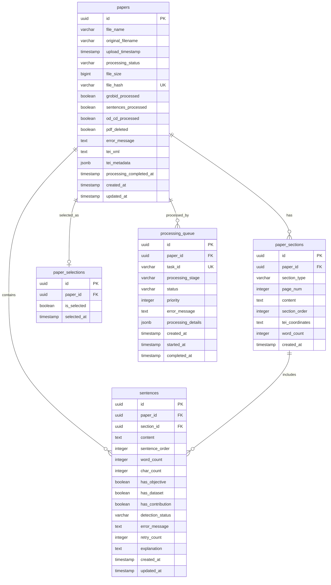

# 資料庫 ER 圖

## 實體關係圖 (Entity Relationship Diagram)

以下是論文分析系統的完整資料庫實體關係圖：



## 關係說明

### 1. papers → paper_sections (一對多)
- 一篇論文可以有多個章節
- 章節必須屬於一篇論文
- 刪除論文時會級聯刪除所有章節

### 2. papers → sentences (一對多)
- 一篇論文可以有多個句子
- 句子必須屬於一篇論文
- 刪除論文時會級聯刪除所有句子

### 3. paper_sections → sentences (一對多)
- 一個章節可以有多個句子
- 句子必須屬於一個章節
- 刪除章節時會級聯刪除所有句子

### 4. papers → paper_selections (一對一)
- 一篇論文最多有一個選擇記錄
- 選擇記錄必須關聯到一篇論文
- 使用 UNIQUE 約束確保一對一關係

### 5. papers → processing_queue (一對多)
- 一篇論文可以有多個處理任務
- 處理任務必須關聯到一篇論文
- 刪除論文時會級聯刪除所有處理任務

## 索引策略

### 主鍵索引 (自動創建)
- 所有表格的 `id` 欄位都有主鍵索引
- 使用 UUID 類型確保全域唯一性

### 外鍵索引
```sql
-- 提升 JOIN 查詢效能
CREATE INDEX idx_sections_paper_id ON paper_sections(paper_id);
CREATE INDEX idx_sentences_paper_id ON sentences(paper_id);
CREATE INDEX idx_sentences_section_id ON sentences(section_id);
CREATE INDEX idx_selections_paper_id ON paper_selections(paper_id);
CREATE INDEX idx_queue_paper_id ON processing_queue(paper_id);
```

### 查詢優化索引
```sql
-- 狀態查詢
CREATE INDEX idx_papers_status ON papers(processing_status);
CREATE INDEX idx_sentences_detection_status ON sentences(detection_status);
CREATE INDEX idx_queue_status ON processing_queue(status);

-- 時間排序
CREATE INDEX idx_papers_created_at ON papers(created_at);
CREATE INDEX idx_queue_priority ON processing_queue(priority, created_at);

-- 全文搜索
CREATE INDEX idx_sentences_text_search ON sentences USING gin(to_tsvector('english', content));
```

## 資料完整性

### 外鍵約束
- 所有外鍵都設置了 `ON DELETE CASCADE`
- 確保資料一致性，避免孤立記錄

### 檢查約束
- `processing_status` 限制為有效值
- `detection_status` 限制為有效值
- `retry_count` 限制在合理範圍內
- `file_size` 必須為非負數

### 唯一性約束
- `papers.file_hash` 確保檔案不重複
- `paper_selections.paper_id` 確保一篇論文只有一個選擇記錄
- `processing_queue.task_id` 確保任務 ID 唯一

## 效能考量

### 查詢優化
1. **論文列表查詢**: 使用 `idx_papers_created_at` 索引
2. **章節內容查詢**: 使用 `idx_sections_paper_id` 索引
3. **句子搜索**: 使用全文搜索索引
4. **狀態篩選**: 使用狀態索引

### 資料分割建議
對於大量資料的情況，可考慮：
- 按時間分割 `papers` 表格
- 按論文 ID 分割 `sentences` 表格

### 快取策略
- 論文基本資訊適合快取
- 章節統計資訊適合快取
- 搜索結果適合短期快取 