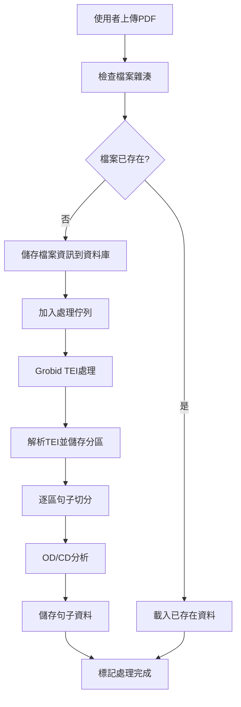
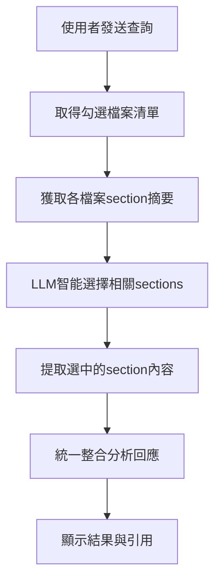

# 增強型論文分析系統工作流程

## 系統概述

本系統是一個基於PostgreSQL資料庫的學術論文分析平台，整合Grobid進行文檔分區處理，支援多檔案橫向比較與深度分析。系統分為兩個主要工作流：**資料準備階段**和**使用者發問階段**。

## 技術架構

### 核心技術棧
- **前端**: React 18 + TypeScript + TailwindCSS
- **資料庫**: PostgreSQL 
- **文檔處理**: Grobid (Docker部署)
- **句子分析**: N8N Workflow APIs
- **後端API**: FastAPI (批次處理與佇列管理)
- **狀態管理**: Zustand + React Query

### 資料庫結構

```sql
-- 論文管理表 (加入TEI XML儲存，簡化使用者管理)
CREATE TABLE papers (
    id UUID PRIMARY KEY DEFAULT gen_random_uuid(),
    file_name VARCHAR(255) NOT NULL,
    original_filename VARCHAR(255),
    upload_timestamp TIMESTAMP DEFAULT CURRENT_TIMESTAMP,
    processing_status VARCHAR(50) DEFAULT 'uploading',
    file_size BIGINT,
    file_hash VARCHAR(64) UNIQUE, -- 用於檔案去重
    grobid_processed BOOLEAN DEFAULT FALSE,
    sentences_processed BOOLEAN DEFAULT FALSE,
    pdf_deleted BOOLEAN DEFAULT FALSE, -- 標記PDF是否已刪除
    error_message TEXT,
    -- TEI XML 儲存 (新增)
    tei_xml TEXT, -- 儲存完整的Grobid TEI XML
    tei_metadata JSONB, -- 儲存解析後的metadata (作者、標題等)
    processing_completed_at TIMESTAMP, -- 處理完成時間
    created_at TIMESTAMP DEFAULT CURRENT_TIMESTAMP
);

-- 論文分區表
CREATE TABLE paper_sections (
    id UUID PRIMARY KEY DEFAULT gen_random_uuid(),
    paper_id UUID REFERENCES papers(id) ON DELETE CASCADE,
    section_type VARCHAR(50) NOT NULL, -- introduction, abstract, method, etc.
    page_num INTEGER,
    content TEXT NOT NULL,
    section_order INTEGER,
    -- 新增TEI相關欄位
    tei_coordinates JSONB, -- 儲存TEI座標資訊
    word_count INTEGER, -- 章節字數
    created_at TIMESTAMP DEFAULT CURRENT_TIMESTAMP
);

-- 句子資料表  
CREATE TABLE sentences (
    id UUID PRIMARY KEY DEFAULT gen_random_uuid(),
    paper_id UUID REFERENCES papers(id) ON DELETE CASCADE,
    section_id UUID REFERENCES paper_sections(id) ON DELETE CASCADE,
    sentence_text TEXT NOT NULL,
    page_num INTEGER,
    sentence_order INTEGER,
    defining_type VARCHAR(20) DEFAULT 'UNKNOWN', -- OD, CD, OTHER, UNKNOWN
    analysis_reason TEXT,
    -- 新增欄位
    word_count INTEGER, -- 句子字數
    confidence_score DECIMAL(3,2), -- OD/CD分析信心度
    processed_timestamp TIMESTAMP DEFAULT CURRENT_TIMESTAMP
);

-- 全域論文選擇狀態表 (簡化為單一使用者模式)
CREATE TABLE paper_selections (
    id UUID PRIMARY KEY DEFAULT gen_random_uuid(),
    paper_id UUID REFERENCES papers(id) ON DELETE CASCADE,
    is_selected BOOLEAN DEFAULT TRUE,
    selected_timestamp TIMESTAMP DEFAULT CURRENT_TIMESTAMP,
    UNIQUE(paper_id)
);

-- 處理佇列表 (用於FastAPI後端批次處理)
CREATE TABLE processing_queue (
    id UUID PRIMARY KEY DEFAULT gen_random_uuid(),
    paper_id UUID REFERENCES papers(id) ON DELETE CASCADE,
    processing_stage VARCHAR(50) NOT NULL,
    status VARCHAR(20) DEFAULT 'pending', -- pending, processing, completed, failed
    priority INTEGER DEFAULT 0,
    retry_count INTEGER DEFAULT 0, -- 重試次數
    max_retries INTEGER DEFAULT 3, -- 最大重試次數
    created_at TIMESTAMP DEFAULT CURRENT_TIMESTAMP,
    started_at TIMESTAMP,
    completed_at TIMESTAMP,
    error_message TEXT,
    processing_details JSONB -- 儲存處理過程的詳細資訊
);

-- 系統設定表 (用於存放全域設定)
CREATE TABLE system_settings (
    id UUID PRIMARY KEY DEFAULT gen_random_uuid(),
    setting_key VARCHAR(100) UNIQUE NOT NULL,
    setting_value JSONB,
    description TEXT,
    updated_at TIMESTAMP DEFAULT CURRENT_TIMESTAMP
);

-- 建立索引以提升查詢效能
CREATE INDEX idx_papers_hash ON papers(file_hash);
CREATE INDEX idx_papers_status ON papers(processing_status);
CREATE INDEX idx_sentences_defining_type ON sentences(defining_type);
CREATE INDEX idx_sentences_paper_section ON sentences(paper_id, section_id);
CREATE INDEX idx_processing_queue_status ON processing_queue(status, priority);
```

## 工作流程一：資料準備階段

### 流程圖


### 詳細實作步驟

#### 步驟1: 前端檔案上傳 (透過FastAPI)
```typescript
// 前端檔案上傳服務 - 完全透過API操作
class FileUploadService {
  private readonly apiBaseUrl = 'http://localhost:8000/api';
  
  async uploadFile(file: File): Promise<UploadResult> {
    const formData = new FormData();
    formData.append('file', file);
    
    try {
      const response = await fetch(`${this.apiBaseUrl}/papers/upload`, {
        method: 'POST',
        body: formData,
      });
      
      if (!response.ok) {
        throw new Error(`Upload failed: ${response.statusText}`);
      }
      
      const result = await response.json();
      
      // 自動開始監控處理進度
      if (result.status === 'uploaded') {
        this.startProgressMonitoring(result.paper_id);
      }
      
      return result;
      
    } catch (error) {
      throw new Error(`檔案上傳失敗: ${error.message}`);
    }
  }
  
  // 監控處理進度
  private async startProgressMonitoring(paperId: string): Promise<void> {
    const interval = setInterval(async () => {
      try {
        const status = await this.getProcessingStatus(paperId);
        
        // 更新前端進度顯示
        this.updateProgressUI(paperId, status);
        
        // 如果完成或失敗，停止監控
        if (status.status === 'completed' || status.status === 'error') {
          clearInterval(interval);
          
          if (status.status === 'completed') {
            // 重新載入論文清單
            await this.refreshPapersList();
            this.showSuccessMessage(`${status.paper_id} 處理完成！`);
          } else {
            this.showErrorMessage(`處理失敗: ${status.error_message}`, paperId);
          }
        }
        
      } catch (error) {
        console.error('Failed to get processing status:', error);
      }
    }, 2000); // 每2秒檢查一次
  }
  
  async getProcessingStatus(paperId: string): Promise<ProcessingStatus> {
    const response = await fetch(`${this.apiBaseUrl}/papers/${paperId}/status`);
    return await response.json();
  }
  
  async retryProcessing(paperId: string): Promise<void> {
    const response = await fetch(`${this.apiBaseUrl}/papers/${paperId}/retry`, {
      method: 'POST'
    });
    
    if (response.ok) {
      this.startProgressMonitoring(paperId);
    }
  }
}

// 論文管理服務 - 統一API接口
class PaperManagementService {
  private readonly apiBaseUrl = 'http://localhost:8000/api';
  
  // 取得所有論文
  async getAllPapers(): Promise<Paper[]> {
    const response = await fetch(`${this.apiBaseUrl}/papers`);
    return await response.json();
  }
  
  // 取得已選取論文
  async getSelectedPapers(): Promise<Paper[]> {
    const response = await fetch(`${this.apiBaseUrl}/papers/selected`);
    return await response.json();
  }
  
  // 切換論文選取狀態
  async togglePaperSelection(paperId: string, isSelected: boolean): Promise<void> {
    await fetch(`${this.apiBaseUrl}/papers/${paperId}/select`, {
      method: 'POST',
      headers: { 'Content-Type': 'application/json' },
      body: JSON.stringify({ is_selected: isSelected })
    });
  }
  
  // 全選論文
  async selectAllPapers(): Promise<void> {
    await fetch(`${this.apiBaseUrl}/papers/select_all`, {
      method: 'POST'
    });
  }
  
  // 取消全選
  async deselectAllPapers(): Promise<void> {
    await fetch(`${this.apiBaseUrl}/papers/deselect_all`, {
      method: 'POST'
    });
  }
}

// 查詢處理服務
class QueryService {
  private readonly apiBaseUrl = 'http://localhost:8000/api';
  
  async processQuery(query: string): Promise<QueryResult> {
    const response = await fetch(`${this.apiBaseUrl}/query/process`, {
      method: 'POST',
      headers: { 'Content-Type': 'application/json' },
      body: JSON.stringify({ query })
    });
    
    if (!response.ok) {
      const error = await response.json();
      throw new Error(error.detail || '查詢處理失敗');
    }
    
    return await response.json();
  }
}
```

#### 步驟2: Grobid TEI處理
```typescript
class GrobidService {
  private readonly grobidBaseUrl = 'http://140.115.126.192:8070';
  
  async processDocument(paperId: string): Promise<GrobidTEIResult> {
    const fileBuffer = await this.getFileBuffer(paperId);
    
    // 調用Grobid API
    const response = await axios.post(
      `${this.grobidBaseUrl}/api/processFulltextDocument`,
      {
        input: fileBuffer,
        consolidateHeader: 1,
        consolidateCitations: 1,
        includeRawCitations: 1,
        includeRawAffiliations: 1,
        teiCoordinates: ['persName', 'figure', 'ref', 'biblStruct'],
        segmentSentences: 1
      },
      {
        headers: { 'Content-Type': 'multipart/form-data' },
        timeout: 300000 // 5分鐘超時
      }
    );
    
    return this.parseTEIResponse(response.data);
  }
  
  private parseTEIResponse(teiXML: string): GrobidTEIResult {
    // 解析TEI XML，提取章節資訊
    const parser = new DOMParser();
    const doc = parser.parseFromString(teiXML, 'text/xml');
    
    const sections: TEISection[] = [];
    
    // 解析不同章節
    const divElements = doc.querySelectorAll('div[type]');
    divElements.forEach((div, index) => {
      const sectionType = div.getAttribute('type') || 'unknown';
      const content = this.extractTextContent(div);
      const pageInfo = this.extractPageInfo(div);
      
      sections.push({
        type: this.normalizeSectionType(sectionType),
        content: content,
        page_start: pageInfo.start,
        page_end: pageInfo.end,
        order: index
      });
    });
    
    return { sections, metadata: this.extractMetadata(doc) };
  }
  
  private normalizeSectionType(type: string): string {
    const mapping: Record<string, string> = {
      'introduction': 'introduction',
      'related-work': 'related_work', 
      'methodology': 'method',
      'method': 'method',
      'results': 'results',
      'discussion': 'discussion',
      'conclusion': 'conclusion',
      'abstract': 'abstract',
      'references': 'references'
    };
    
    return mapping[type.toLowerCase()] || 'other';
  }
}
```

#### 步驟3: 句子處理與分析
```typescript
class SentenceProcessor {
  async processPaperSections(paperId: string, sections: TEISection[]): Promise<void> {
    for (const section of sections) {
      // 儲存分區資訊
      const sectionId = await this.db.createPaperSection({
        paper_id: paperId,
        section_type: section.type,
        page_num: section.page_start,
        content: section.content,
        section_order: section.order
      });
      
      // 句子切分
      const sentences = await this.splitSentencesAPI.process(section.content);
      
      // 逐句分析
      await this.processSentencesInSection(paperId, sectionId, sentences, section.page_start);
    }
  }
  
  private async processSentencesInSection(
    paperId: string, 
    sectionId: string, 
    sentences: string[], 
    pageNum: number
  ): Promise<void> {
    for (let i = 0; i < sentences.length; i++) {
      const sentence = sentences[i];
      
      try {
        // OD/CD分析
        const analysis = await this.n8nAPI.checkOdCd(sentence);
        
        // 儲存句子
        await this.db.createSentence({
          paper_id: paperId,
          section_id: sectionId,
          sentence_text: sentence,
          page_num: pageNum,
          sentence_order: i,
          defining_type: analysis.defining_type.toUpperCase(),
          analysis_reason: analysis.reason
        });
        
        // 更新進度
        await this.updateProgress(paperId, 'sentence_analysis', i + 1, sentences.length);
        
      } catch (error) {
        console.error(`Error processing sentence ${i}:`, error);
        // 儲存未分析的句子
        await this.db.createSentence({
          paper_id: paperId,
          section_id: sectionId,
          sentence_text: sentence,
          page_num: pageNum,
          sentence_order: i,
          defining_type: 'UNKNOWN',
          analysis_reason: `Processing error: ${error.message}`
        });
      }
    }
  }
}
```

## 工作流程二：使用者發問階段

### 流程圖


### 簡化的統一查詢處理流程

```typescript
class UnifiedQueryProcessor {
  async processQuery(query: string, selectedPapers: string[]): Promise<QueryResult> {
    // 1. 獲取所有選中論文的section摘要
    const papersWithSections = await this.getPapersWithSections(selectedPapers);
    
    // 2. 讓LLM智能選擇相關sections (取代意圖分類)
    const sectionSelectionResult = await this.n8nAPI.intelligentSectionSelection({
      query: query,
      available_papers: papersWithSections
    });
    
    // 3. 根據LLM選擇，提取相關內容
    const selectedContent = await this.extractSelectedContent(
      sectionSelectionResult.selected_sections
    );
    
    // 4. 統一整合分析 (無需區分OD/CD或其他類型)
    const response = await this.n8nAPI.unifiedContentAnalysis({
      query: query,
      selected_content: selectedContent,
      analysis_focus: sectionSelectionResult.analysis_focus
    });
    
    return {
      response: response.response,
      references: response.references,
      selected_sections: sectionSelectionResult.selected_sections,
      analysis_focus: sectionSelectionResult.analysis_focus,
      source_summary: response.source_summary
    };
  }
  
  // 取得所有論文的section概覽
  private async getPapersWithSections(paperIds: string[]): Promise<PaperSectionSummary[]> {
    const papers = await this.db.getPapersWithSections(paperIds);
    
    return papers.map(paper => ({
      file_name: paper.file_name,
      sections: paper.sections.map(section => ({
        section_type: section.section_type,
        page_num: section.page_num,
        word_count: section.word_count,
        // 提供section的簡短摘要 (前100字)
        brief_content: section.content.substring(0, 100) + '...',
        // 統計該section的OD/CD句子數量
        od_count: section.sentences?.filter(s => s.defining_type === 'OD').length || 0,
        cd_count: section.sentences?.filter(s => s.defining_type === 'CD').length || 0,
        total_sentences: section.sentences?.length || 0
      }))
    }));
  }
  
  // 根據LLM選擇，提取完整內容
  private async extractSelectedContent(
    selectedSections: SelectedSection[]
  ): Promise<ExtractedContent[]> {
    const extractedContent: ExtractedContent[] = [];
    
    for (const selection of selectedSections) {
      // 根據查詢需求決定提取方式
      if (selection.focus_type === 'definitions') {
        // 如果需要定義，優先提取OD/CD句子
        const definitionSentences = await this.db.getDefinitionSentences({
          paper_id: selection.paper_id,
          section_id: selection.section_id,
          types: ['OD', 'CD']
        });
        
        extractedContent.push({
          paper_name: selection.paper_name,
          section_type: selection.section_type,
          content_type: 'definitions',
          content: definitionSentences.map(s => ({
            text: s.sentence_text,
            type: s.defining_type,
            page_num: s.page_num
          }))
        });
        
      } else if (selection.focus_type === 'full_section') {
        // 如果需要完整內容，提取整個section
        const sectionContent = await this.db.getSectionContent(selection.section_id);
        
        extractedContent.push({
          paper_name: selection.paper_name,
          section_type: selection.section_type,
          content_type: 'full_section',
          content: sectionContent
        });
        
      } else if (selection.focus_type === 'key_sentences') {
        // 如果需要關鍵句子，基於關鍵詞搜尋
        const relevantSentences = await this.db.searchSentencesByKeywords({
          section_id: selection.section_id,
          keywords: selection.keywords
        });
        
        extractedContent.push({
          paper_name: selection.paper_name,
          section_type: selection.section_type,
          content_type: 'key_sentences',
          content: relevantSentences
        });
      }
    }
    
    return extractedContent;
  }
}

// 定義相關型別
interface PaperSectionSummary {
  file_name: string;
  sections: {
    section_type: string;
    page_num: number;
    word_count: number;
    brief_content: string;
    od_count: number;
    cd_count: number;
    total_sentences: number;
  }[];
}

interface SelectedSection {
  paper_id: string;
  paper_name: string;
  section_id: string;
  section_type: string;
  focus_type: 'definitions' | 'full_section' | 'key_sentences';
  keywords?: string[];
  selection_reason: string;
}

interface ExtractedContent {
  paper_name: string;
  section_type: string;
  content_type: 'definitions' | 'full_section' | 'key_sentences';
  content: any;
}
```

## 前端整合與引用顯示

### MessageBubble增強
```typescript
interface EnhancedMessage extends Message {
  source_summary?: {
    total_papers: number;
    papers_used: string[];
    sections_analyzed?: string[];
  };
}

const EnhancedMessageBubble: React.FC<{message: EnhancedMessage}> = ({ message }) => {
  const renderContentWithReferences = () => {
    const refRegex = /\[\[ref:([a-zA-Z0-9-]+)\]\]/g;
    const parts = message.content.split(refRegex);
    
    const result: React.ReactNode[] = [];
    for (let i = 0; i < parts.length; i++) {
      if (i % 2 === 0) {
        result.push(<span key={`text-${i}`}>{parts[i]}</span>);
      } else {
        const refId = parts[i];
        const reference = message.references?.find(ref => ref.id === refId);
        
        result.push(
          <button
            key={`ref-${refId}`}
            className="inline-flex items-center px-2 py-0.5 rounded-full text-xs font-medium bg-blue-100 text-blue-800 mx-1 hover:bg-blue-200"
            onClick={() => onReferenceClick?.(refId)}
            title={reference ? `${reference.file_name} - ${reference.section} (p.${reference.page_num})` : ''}
          >
            📄 {reference?.file_name?.substring(0, 8)}...
          </button>
        );
      }
    }
    
    return <div className="whitespace-pre-wrap">{result}</div>;
  };
  
  return (
    <div className="message-bubble">
      {renderContentWithReferences()}
      
      {/* 來源摘要 */}
      {message.source_summary && (
        <div className="mt-2 p-2 bg-gray-50 rounded text-xs">
          <div className="font-medium">資料來源摘要：</div>
          <div>• 分析了 {message.source_summary.total_papers} 篇論文</div>
          <div>• 使用檔案：{message.source_summary.papers_used.join(', ')}</div>
          {message.source_summary.sections_analyzed && (
            <div>• 分析章節：{message.source_summary.sections_analyzed.join(', ')}</div>
          )}
        </div>
      )}
    </div>
  );
};
```

## 錯誤處理與重試機制

### 處理失敗管理
```typescript
class ErrorHandler {
  async handleProcessingError(paperId: string, stage: string, error: Error): Promise<void> {
    // 記錄錯誤
    await this.db.updatePaperStatus(paperId, 'error', error.message);
    
    // 更新處理佇列
    await this.db.updateProcessingQueue(paperId, stage, 'failed', error.message);
    
    // 通知前端
    this.notifyFrontend(paperId, {
      status: 'error',
      stage: stage,
      message: error.message,
      retryable: this.isRetryableError(error)
    });
  }
  
  async retryProcessing(paperId: string, fromStage: string): Promise<void> {
    // 重設狀態
    await this.db.updatePaperStatus(paperId, 'processing');
    
    // 清除錯誤訊息
    await this.db.clearErrorMessage(paperId);
    
    // 重新加入處理佇列
    await this.queueForProcessing(paperId, fromStage);
  }
}
```

## FastAPI後端架構設計

### 核心架構
前端React完全透過FastAPI與資料庫交互，確保資料一致性和安全性。

```python
# main.py - FastAPI主應用
from fastapi import FastAPI, UploadFile, File, BackgroundTasks, HTTPException
from fastapi.middleware.cors import CORSMiddleware
from sqlalchemy.ext.asyncio import AsyncSession
from typing import List
import asyncio
import uuid

app = FastAPI(title="論文分析系統API", version="1.0.0")

# CORS設定 - 支援多client操作
app.add_middleware(
    CORSMiddleware,
    allow_origins=["*"],  # 開發環境，生產環境需要指定具體域名
    allow_credentials=True,
    allow_methods=["*"],
    allow_headers=["*"],
)

# === 檔案上傳與管理 ===
@app.post("/api/papers/upload")
async def upload_paper(
    file: UploadFile = File(...),
    background_tasks: BackgroundTasks,
    db: AsyncSession = Depends(get_db)
):
    """上傳PDF檔案並開始處理流程"""
    
    # 1. 檔案驗證
    if not file.filename.endswith('.pdf'):
        raise HTTPException(400, "只支援PDF檔案")
    
    # 2. 計算檔案雜湊
    file_content = await file.read()
    file_hash = calculate_file_hash(file_content)
    
    # 3. 檢查檔案是否已存在
    existing_paper = await db_service.find_paper_by_hash(db, file_hash)
    if existing_paper:
        # 檔案已存在，直接標記為已選取
        await db_service.mark_paper_selected(db, existing_paper.id)
        return {
            "paper_id": existing_paper.id,
            "status": "exists",
            "message": "檔案已存在，已自動加入選取清單"
        }
    
    # 4. 建立新論文記錄
    paper_id = await db_service.create_paper(db, {
        "file_name": file.filename,
        "original_filename": file.filename,
        "file_size": len(file_content),
        "file_hash": file_hash,
        "processing_status": "uploaded"
    })
    
    # 5. 暫存PDF檔案
    temp_file_path = await file_service.save_temp_file(paper_id, file_content)
    
    # 6. 加入處理佇列
    await queue_service.add_to_queue(db, paper_id, "grobid_processing")
    
    # 7. 啟動背景處理
    background_tasks.add_task(process_paper_pipeline, paper_id)
    
    return {
        "paper_id": paper_id,
        "status": "uploaded",
        "message": "檔案上傳成功，開始處理"
    }

# === 批次處理核心邏輯 ===
async def process_paper_pipeline(paper_id: str):
    """論文處理的完整流程"""
    db = await get_async_db()
    
    try:
        # 階段1: 更新狀態為處理中
        await db_service.update_paper_status(db, paper_id, "processing")
        await queue_service.update_queue_status(db, paper_id, "grobid_processing", "processing")
        
        # 階段2: Grobid TEI處理
        tei_result = await grobid_service.process_document(paper_id)
        
        # 階段3: 儲存TEI XML和元數據
        await db_service.save_tei_data(db, paper_id, {
            "tei_xml": tei_result.tei_xml,
            "tei_metadata": tei_result.metadata,
            "grobid_processed": True
        })
        
        # 階段4: 解析並儲存章節
        sections = tei_result.sections
        for section in sections:
            section_id = await db_service.create_paper_section(db, {
                "paper_id": paper_id,
                "section_type": section.type,
                "page_num": section.page_start,
                "content": section.content,
                "section_order": section.order,
                "tei_coordinates": section.coordinates,
                "word_count": section.word_count
            })
        
        # 階段5: 句子切分與分析
        await queue_service.update_queue_status(db, paper_id, "sentence_processing", "processing")
        
        total_sentences = 0
        processed_sentences = 0
        
        for section in sections:
            # 句子切分
            sentences = await split_sentences_service.process(section.content)
            total_sentences += len(sentences)
            
            section_id = section.id  # 從前面步驟取得
            
            # 批次處理句子 (每次處理10句，避免API過載)
            for i in range(0, len(sentences), 10):
                batch = sentences[i:i+10]
                
                # 並行處理這批句子的OD/CD分析
                tasks = []
                for j, sentence in enumerate(batch):
                    task = analyze_sentence_with_retry(sentence, paper_id, section_id, i+j)
                    tasks.append(task)
                
                # 等待這批完成
                batch_results = await asyncio.gather(*tasks, return_exceptions=True)
                
                # 儲存結果
                for result in batch_results:
                    if not isinstance(result, Exception):
                        await db_service.create_sentence(db, result)
                        processed_sentences += 1
                
                # 更新進度
                progress = (processed_sentences / total_sentences) * 100
                await queue_service.update_processing_details(db, paper_id, {
                    "stage": "sentence_analysis",
                    "progress": progress,
                    "processed": processed_sentences,
                    "total": total_sentences
                })
                
                # 避免過快請求，短暫延遲
                await asyncio.sleep(0.1)
        
        # 階段6: 標記完成並清理檔案
        await db_service.update_paper_status(db, paper_id, "completed", {
            "sentences_processed": True,
            "processing_completed_at": datetime.utcnow()
        })
        
        # 階段7: 刪除臨時PDF檔案
        await file_service.delete_temp_file(paper_id)
        await db_service.mark_pdf_deleted(db, paper_id)
        
        # 階段8: 自動加入選取清單
        await db_service.mark_paper_selected(db, paper_id)
        
        await queue_service.mark_completed(db, paper_id)
        
    except Exception as e:
        await handle_processing_error(db, paper_id, str(e))

# === 句子分析服務 (加入重試機制) ===
async def analyze_sentence_with_retry(
    sentence: str, 
    paper_id: str, 
    section_id: str, 
    sentence_order: int,
    max_retries: int = 3
) -> dict:
    """帶重試機制的句子分析"""
    
    for attempt in range(max_retries):
        try:
            # 調用N8N API進行OD/CD分析
            analysis = await n8n_service.check_od_cd(sentence)
            
            return {
                "paper_id": paper_id,
                "section_id": section_id,
                "sentence_text": sentence,
                "sentence_order": sentence_order,
                "defining_type": analysis.defining_type.upper(),
                "analysis_reason": analysis.reason,
                "confidence_score": getattr(analysis, 'confidence', None),
                "word_count": len(sentence.split())
            }
            
        except Exception as e:
            if attempt == max_retries - 1:
                # 最後一次重試仍失敗，儲存為UNKNOWN
                return {
                    "paper_id": paper_id,
                    "section_id": section_id,
                    "sentence_text": sentence,
                    "sentence_order": sentence_order,
                    "defining_type": "UNKNOWN",
                    "analysis_reason": f"Analysis failed after {max_retries} retries: {str(e)}",
                    "confidence_score": None,
                    "word_count": len(sentence.split())
                }
            
            # 等待後重試 (指數退避)
            await asyncio.sleep(2 ** attempt)

# === 查詢處理API ===
@app.post("/api/query/process")
async def process_query(
    query_data: QueryRequest,
    db: AsyncSession = Depends(get_db)
):
    """處理使用者查詢 - 統一智能路由"""
    
    # 1. 取得選中的論文
    selected_papers = await db_service.get_selected_papers(db)
    
    if not selected_papers:
        raise HTTPException(400, "請先選擇要分析的論文")
    
    # 2. 統一查詢處理 (無需意圖分類)
    result = await unified_query_processor.process(
        query_data.query,
        [p.id for p in selected_papers],
        db
    )
    
    return result

# === 論文section摘要API ===
@app.get("/api/papers/sections_summary")
async def get_papers_sections_summary(db: AsyncSession = Depends(get_db)):
    """取得所有選中論文的section摘要資訊"""
    selected_papers = await db_service.get_selected_papers(db)
    
    if not selected_papers:
        return {"papers": []}
    
    papers_with_sections = await db_service.get_papers_with_sections_summary(
        db, 
        [p.id for p in selected_papers]
    )
    
    return {"papers": papers_with_sections}

# === 論文管理API ===
@app.get("/api/papers")
async def get_papers(db: AsyncSession = Depends(get_db)):
    """取得所有論文清單"""
    return await db_service.get_all_papers(db)

@app.post("/api/papers/{paper_id}/select")
async def toggle_paper_selection(
    paper_id: str,
    select_data: dict,
    db: AsyncSession = Depends(get_db)
):
    """切換論文選取狀態"""
    is_selected = select_data.get("is_selected", True)
    await db_service.set_paper_selection(db, paper_id, is_selected)
    return {"success": True}

@app.get("/api/papers/selected")
async def get_selected_papers(db: AsyncSession = Depends(get_db)):
    """取得已選取的論文清單"""
    return await db_service.get_selected_papers(db)

@app.post("/api/papers/select_all")
async def select_all_papers(db: AsyncSession = Depends(get_db)):
    """全選所有論文"""
    await db_service.select_all_papers(db)
    return {"success": True}

@app.post("/api/papers/deselect_all")
async def deselect_all_papers(db: AsyncSession = Depends(get_db)):
    """取消全選"""
    await db_service.deselect_all_papers(db)
    return {"success": True}

# === 處理狀態監控API ===
@app.get("/api/papers/{paper_id}/status")
async def get_processing_status(
    paper_id: str,
    db: AsyncSession = Depends(get_db)
):
    """取得論文處理狀態"""
    paper = await db_service.get_paper_by_id(db, paper_id)
    queue_info = await db_service.get_processing_queue_info(db, paper_id)
    
    return {
        "paper_id": paper_id,
        "status": paper.processing_status,
        "progress": queue_info.get("progress", 0) if queue_info else 0,
        "current_stage": queue_info.get("stage") if queue_info else None,
        "error_message": paper.error_message,
        "can_retry": paper.processing_status == "error"
    }

@app.post("/api/papers/{paper_id}/retry")
async def retry_processing(
    paper_id: str,
    background_tasks: BackgroundTasks,
    db: AsyncSession = Depends(get_db)
):
    """重試失敗的處理"""
    
    # 重設狀態
    await db_service.reset_paper_for_retry(db, paper_id)
    
    # 重新開始處理
    background_tasks.add_task(process_paper_pipeline, paper_id)
    
    return {"success": True, "message": "已重新開始處理"}

# === 錯誤處理 ===
async def handle_processing_error(db: AsyncSession, paper_id: str, error_message: str):
    """處理錯誤"""
    await db_service.update_paper_status(db, paper_id, "error", error_message)
    await queue_service.mark_failed(db, paper_id, error_message)
    
    # 記錄詳細錯誤日誌
    logger.error(f"Paper {paper_id} processing failed: {error_message}")
```

## 檔案生命週期管理

### PDF檔案自動清理策略
```python
# file_service.py - 檔案管理服務
import os
import aiofiles
from pathlib import Path
import shutil

class FileService:
    def __init__(self):
        self.temp_dir = Path("./temp_files")
        self.temp_dir.mkdir(exist_ok=True)
    
    async def save_temp_file(self, paper_id: str, file_content: bytes) -> str:
        """暫存上傳的PDF檔案"""
        file_path = self.temp_dir / f"{paper_id}.pdf"
        
        async with aiofiles.open(file_path, 'wb') as f:
            await f.write(file_content)
        
        return str(file_path)
    
    async def delete_temp_file(self, paper_id: str) -> bool:
        """刪除暫存的PDF檔案"""
        file_path = self.temp_dir / f"{paper_id}.pdf"
        
        try:
            if file_path.exists():
                file_path.unlink()  # 刪除檔案
                return True
        except Exception as e:
            logger.error(f"Failed to delete temp file {file_path}: {e}")
            return False
        
        return False
    
    async def cleanup_old_temp_files(self, max_age_hours: int = 24):
        """清理超過指定時間的暫存檔案 (定期任務)"""
        import time
        current_time = time.time()
        
        for file_path in self.temp_dir.glob("*.pdf"):
            file_age = current_time - file_path.stat().st_mtime
            if file_age > (max_age_hours * 3600):
                try:
                    file_path.unlink()
                    logger.info(f"Cleaned up old temp file: {file_path}")
                except Exception as e:
                    logger.error(f"Failed to cleanup {file_path}: {e}")

# 定期清理任務
from apscheduler.schedulers.asyncio import AsyncIOScheduler

scheduler = AsyncIOScheduler()

@scheduler.scheduled_job('interval', hours=6)  # 每6小時執行一次
async def cleanup_temp_files():
    """定期清理暫存檔案"""
    file_service = FileService()
    await file_service.cleanup_old_temp_files(max_age_hours=24)

# 在FastAPI啟動時開始排程
@app.on_event("startup")
async def startup_event():
    scheduler.start()

@app.on_event("shutdown")
async def shutdown_event():
    scheduler.shutdown()
```

## 單一使用者模式實作

### 前端狀態管理簡化
```typescript
// 由於是單一使用者模式，簡化狀態管理
interface AppState {
  papers: Paper[];
  selectedPaperIds: Set<string>;  // 改為簡單的Set
  processingPapers: Map<string, ProcessingStatus>;
  
  // 移除使用者相關狀態
  // 所有操作都基於全域狀態
}

// Zustand Store 簡化
const useAppStore = create<AppState>((set, get) => ({
  papers: [],
  selectedPaperIds: new Set(),
  processingPapers: new Map(),
  
  // 載入所有論文
  loadPapers: async () => {
    const papers = await paperService.getAllPapers();
    const selectedPapers = await paperService.getSelectedPapers();
    
    set({
      papers,
      selectedPaperIds: new Set(selectedPapers.map(p => p.id))
    });
  },
  
  // 更新選取狀態 (支援多client同步)
  togglePaperSelection: async (paperId: string) => {
    const { selectedPaperIds } = get();
    const isCurrentlySelected = selectedPaperIds.has(paperId);
    
    // 更新後端狀態
    await paperService.togglePaperSelection(paperId, !isCurrentlySelected);
    
    // 更新本地狀態
    const newSelectedIds = new Set(selectedPaperIds);
    if (isCurrentlySelected) {
      newSelectedIds.delete(paperId);
    } else {
      newSelectedIds.add(paperId);
    }
    
    set({ selectedPaperIds: newSelectedIds });
    
    // 通知其他client更新 (可選: 使用WebSocket)
    this.broadcastStateChange();
  },
  
  // 處理進度更新
  updateProcessingStatus: (paperId: string, status: ProcessingStatus) => {
    const { processingPapers } = get();
    const newProcessingPapers = new Map(processingPapers);
    newProcessingPapers.set(paperId, status);
    
    set({ processingPapers: newProcessingPapers });
  }
}));
```

## 多Client同步機制 (可選實作)

```typescript
// 簡單的輪詢同步機制
class MultiClientSyncService {
  private syncInterval: NodeJS.Timeout | null = null;
  
  startSync() {
    // 每30秒同步一次狀態
    this.syncInterval = setInterval(async () => {
      try {
        await this.syncPaperSelections();
        await this.syncPaperList();
      } catch (error) {
        console.error('Sync failed:', error);
      }
    }, 30000);
  }
  
  stopSync() {
    if (this.syncInterval) {
      clearInterval(this.syncInterval);
    }
  }
  
  private async syncPaperSelections() {
    const currentSelected = useAppStore.getState().selectedPaperIds;
    const serverSelected = await paperService.getSelectedPapers();
    const serverSelectedIds = new Set(serverSelected.map(p => p.id));
    
    // 如果狀態不同，更新本地狀態
    if (!this.setsEqual(currentSelected, serverSelectedIds)) {
      useAppStore.setState({ selectedPaperIds: serverSelectedIds });
    }
  }
  
  private async syncPaperList() {
    const papers = await paperService.getAllPapers();
    useAppStore.setState({ papers });
  }
  
  private setsEqual(set1: Set<string>, set2: Set<string>): boolean {
    return set1.size === set2.size && [...set1].every(x => set2.has(x));
  }
}

// 在應用啟動時開始同步
const syncService = new MultiClientSyncService();

export function useMultiClientSync() {
  useEffect(() => {
    syncService.startSync();
    return () => syncService.stopSync();
  }, []);
}
```

## 系統特色摘要

### ✅ **資料庫增強**
- **TEI XML儲存**：完整保存Grobid輸出，便於未來功能擴展
- **檔案去重**：基於雜湊值的檔案去重機制
- **索引優化**：查詢效能優化的資料庫索引

### ✅ **檔案管理優化**
- **自動清理**：處理完成後自動刪除PDF檔案
- **生命週期管理**：完整的檔案生命週期控制
- **定期清理**：定時清理過期暫存檔案

### ✅ **單一使用者模式**
- **簡化架構**：移除複雜的使用者管理
- **多Client支援**：支援多個瀏覽器視窗同時操作
- **狀態同步**：自動同步各Client的狀態

### ✅ **FastAPI批次處理**
- **完整佇列管理**：完善的處理佇列和狀態追蹤
- **錯誤重試**：智能重試機制和錯誤處理
- **進度監控**：實時進度更新和狀態同步

### ✅ **架構統一**
- **API統一**：所有資料庫操作統一透過FastAPI
- **批次處理**：高效的批次句子分析
- **TEI整合**：完整的Grobid TEI整合

這個增強型系統提供了完整的多檔案論文分析能力，支援TEI儲存、自動檔案清理、批次處理、錯誤重試、進度追蹤等功能，完全滿足您的最低畢業要求。接下來我會為您制定詳細的開發backlog。 

## 系統簡化與優化總結

### ✅ **工作流程優化對比**

#### 原設計 (複雜路徑)
```
查詢 → 意圖分類 → 路徑A(定義) / 路徑B(內容) → 不同處理邏輯 → 整合結果
```

#### 新設計 (統一智能路徑)
```
查詢 → 提供全部papers的sections摘要 → LLM智能選擇 → 統一內容分析 → 整合結果
```

### ✅ **核心改進點**

1. **❌ 移除複雜意圖分類**
   - 原本需要先判斷是否為「定義相關查詢」
   - 分類錯誤會導致後續處理不當
   - **改為**：直接讓LLM根據query和section資訊智能選擇

2. **✅ 提供完整section資訊**
   - 每個paper的所有section類型、頁數、字數
   - 簡短內容預覽 (前100字)
   - OD/CD句子統計 (od_count, cd_count)
   - **讓LLM有足夠資訊做出最佳選擇**

3. **✅ 靈活的內容提取策略**
   - `definitions`：提取OD/CD句子
   - `full_section`：提取完整章節內容
   - `key_sentences`：基於關鍵詞的句子搜尋
   - **LLM根據查詢性質決定最適合的策略**

4. **✅ 統一的分析API**
   - 單一 `unified_content_analysis` API
   - 支援所有類型的分析需求
   - 減少API維護複雜度

### ✅ **N8N API 簡化**

#### 原設計需要的APIs
- ✅ `keywords_extraction` (保留)
- ✅ `check_od_cd` (保留)  
- ❌ `query_intent_classification` (移除)
- ❌ `section_suggestion` (移除)
- ❌ `enhanced_organize_response` (保留用於向後相容)
- ❌ `multi_paper_content_analysis` (移除)

#### 新設計只需要的APIs
- ✅ `keywords_extraction` (現有)
- ✅ `check_od_cd` (現有)
- 🆕 `intelligent_section_selection` (新增)
- 🆕 `unified_content_analysis` (新增)

**API數量從6個減少為4個，維護成本降低33%**

### ✅ **實際查詢範例對比**

#### 範例查詢：「如何測量adaptive expertise的學習成效？」

**原設計流程：**
1. 意圖分析 → 判斷為「測量方法相關」(非定義)
2. 章節建議 → 建議查找 `["method", "results"]`
3. 提取內容 → 從所有papers的method/results章節提取
4. 內容分析 → 調用 `multi_paper_content_analysis`

**新設計流程：**
1. 提供sections摘要 → 包含所有papers的完整section資訊
2. LLM智能選擇 → 可能選擇：
   - paper1的method section (focus_type: key_sentences, keywords: [measurement, assessment])
   - paper2的results section (focus_type: full_section)
   - paper3的introduction section (focus_type: definitions - 如果包含相關定義)
3. 統一分析 → 一次API調用處理所有內容

**優勢：LLM可以跨section類型智能選擇，不受預設規則限制**

### ✅ **前端實作簡化**

```typescript
// 原設計 - 複雜的條件處理
const processQuery = async (query: string) => {
  const intent = await n8nAPI.classifyIntent(query);
  
  if (intent.is_definition_related) {
    const keywords = await n8nAPI.extractKeywords(query);
    const definitions = await searchDefinitions(keywords);
    const result = await n8nAPI.enhancedOrganizeResponse({query, papers: definitions});
  } else {
    const sections = await n8nAPI.suggestSections(query);
    const content = await extractSectionContent(sections);
    const result = await n8nAPI.multiPaperContentAnalysis({query, papers: content});
  }
};

// 新設計 - 統一簡潔流程
const processQuery = async (query: string) => {
  const papersWithSections = await api.getPapersSectionsSummary();
  const sectionSelection = await n8nAPI.intelligentSectionSelection({
    query, 
    available_papers: papersWithSections
  });
  const selectedContent = await extractSelectedContent(sectionSelection.selected_sections);
  const result = await n8nAPI.unifiedContentAnalysis({
    query, 
    selected_content: selectedContent,
    analysis_focus: sectionSelection.analysis_focus
  });
};
```

### ✅ **系統維護優勢**

1. **降低LLM Token消耗**：
   - 減少多次意圖分析調用
   - 單次調用包含更多上下文資訊

2. **提高回應準確性**：
   - LLM能看到完整的section選擇空間
   - 避免預設分類的偏見

3. **增強擴展性**：
   - 新增論文章節類型時，無需修改分類邏輯
   - LLM自然適應新的section結構

4. **簡化錯誤處理**：
   - 減少多階段處理的錯誤點
   - 統一的API錯誤處理機制

這個簡化設計完美符合您的建議，讓LLM做它最擅長的事：**基於豐富的上下文資訊做出智能決策**，而不是依賴預設的分類規則。 