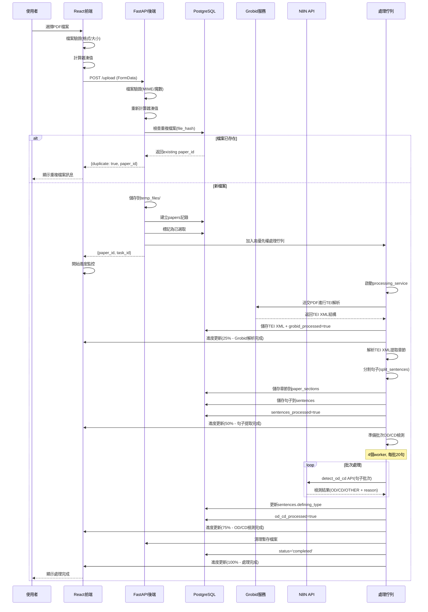

# 檔案上傳流程圖

## 系統概覽

本系統採用**前後端分離架構**，前端使用 React + TypeScript，後端使用 FastAPI + PostgreSQL，整合 Grobid TEI 解析和 N8N API 進行智能文檔處理。

### 核心技術棧
- **前端**: React 18 + TypeScript + TailwindCSS + Zustand
- **後端**: FastAPI + PostgreSQL + SQLAlchemy
- **文檔處理**: Grobid TEI XML 解析
- **AI分析**: N8N API (OD/CD句子類型檢測)
- **文件儲存**: 本地暫存 + 資料庫元資料

---

## 完整流程圖

```mermaid
graph TD
    %% 前端檔案上傳流程
    A["使用者選擇PDF檔案"] --> B["前端檔案驗證<br/>(格式、大小、完整性)"]
    B --> C["計算檔案雜湊值<br/>(用於重複檢測)"]
    C --> D["POST /upload/<br/>上傳到FastAPI後端"]
    
    %% 後端初始處理
    D --> E["後端檔案驗證<br/>(MIME類型、PDF魔數)"]
    E --> F["計算伺服器端雜湊值"]
    F --> G{"檔案是否已存在？<br/>(檢查file_hash)"}
    
    G -->|是| H["返回重複檔案資訊<br/>paper_id + duplicate=true"]
    G -->|否| I["儲存檔案到temp_files/目錄<br/>格式: {hash}_{timestamp}.pdf"]
    
    I --> J["建立papers表記錄<br/>(status: 'uploading')"]
    J --> K["自動標記為已選取<br/>(mark_paper_selected)"]
    K --> L["加入processing_service處理佇列<br/>(HIGH priority)"]
    L --> M["回傳paper_id + task_id<br/>開始進度監控"]
    
    %% 背景處理流程 - 可恢復的多階段處理
    M --> N["背景任務開始<br/>(status: 'processing')"]
    N --> O["階段1: Grobid TEI XML處理<br/>解析PDF結構與內容"]
    O --> P["增量儲存: grobid_processed=true<br/>tei_xml儲存到資料庫"]
    P --> Q["階段2: 章節與句子提取<br/>解析TEI XML獲取結構"]
    Q --> R["儲存章節到paper_sections表<br/>句子分割並儲存到sentences表"]
    R --> S["增量儲存: sentences_processed=true"]
    S --> T["階段3: OD/CD檢測<br/>批次N8N API分析"]
    
    %% N8N批次處理細節
    T --> U["批次處理配置<br/>4個worker, 每批20句"]
    U --> V["並行呼叫N8N detect_od_cd API<br/>判定句子類型: OD/CD/OTHER"]
    V --> W["儲存檢測結果到sentences表<br/>(defining_type + reason)"]
    W --> X["增量儲存: od_cd_processed=true"]
    X --> Y["階段4: 完成處理"]
    Y --> Z["清理暫存PDF檔案<br/>更新status: 'completed'"]
    Z --> AA["前端接收完成通知<br/>更新論文清單"]
    
    %% 錯誤處理流程
    O --> BB{"處理失敗？"}
    Q --> BB
    V --> BB
    BB -->|是| CC["記錄錯誤訊息<br/>status: 'error'"]
    CC --> DD["支援從失敗點恢復<br/>提供重試按鈕"]
    
    %% 前端狀態更新
    H --> EE["前端顯示重複檔案<br/>更新論文清單"]
    AA --> FF["前端顯示處理完成<br/>可開始查詢分析"]
    DD --> GG["前端顯示錯誤<br/>提供重試選項"]
    
    %% 進度監控
    M --> HH["WebSocket/輪詢監控<br/>即時進度更新"]
    HH --> II["進度回報: percentage + step_name<br/>Grobid解析 → 句子提取 → OD/CD檢測"]
    
    %% 樣式定義
    classDef frontend fill:#e1f5fe,stroke:#01579b,stroke-width:2px
    classDef backend fill:#fff3e0,stroke:#e65100,stroke-width:2px
    classDef database fill:#f3e5f5,stroke:#4a148c,stroke-width:2px
    classDef process fill:#e8f5e8,stroke:#1b5e20,stroke-width:2px
    classDef error fill:#ffebee,stroke:#b71c1c,stroke-width:2px
    classDef ai fill:#e0f2f1,stroke:#004d40,stroke-width:2px
    
    class A,B,C,D,EE,FF,GG,HH,II frontend
    class E,F,I,J,K,L,M,N backend
    class G,H,P,R,S,W,X,Z database
    class O,Q,T,Y process
    class BB,CC,DD error
    class U,V ai
```



---

## 詳細序列圖



---

## 核心處理步驟詳解

### 1. 前端檔案驗證
```typescript
// 驗證邏輯位於 file_service.ts
async validate_file(file: UploadFile) -> (bool, str)
- 檔案大小檢查: ≤ 50MB
- 副檔名檢查: 必須為 .pdf
- MIME類型檢查: application/pdf
- PDF魔數檢查: 開頭必須為 %PDF
```

### 2. 雜湊值計算與重複檢測
```python
# 後端 file_service.py
async calculate_file_hash(file: UploadFile) -> str:
    hasher = hashlib.sha256()
    # 分塊讀取，避免大檔案記憶體問題
    chunk_size = 8192
    while chunk := await file.read(chunk_size):
        hasher.update(chunk)
    return hasher.hexdigest()
```

### 3. 資料庫結構更新流程
```sql
-- papers 表狀態更新時序
INSERT papers (status='uploading', file_hash, ...)
UPDATE papers SET grobid_processed=true, tei_xml=? 
UPDATE papers SET sentences_processed=true
UPDATE papers SET od_cd_processed=true  
UPDATE papers SET status='completed'
```

### 4. N8N批次OD/CD檢測
```python
# processing_service.py 中的批次處理
async def _detect_od_cd(sentences_data, grobid_result):
    # 配置: 4個concurrent workers
    max_concurrent = 4
    batch_size = 20
    
    # 批次分割句子
    for batch in chunks(sentences_data, batch_size):
        # 並行處理每個批次
        tasks = [n8n_service.detect_od_cd(sentence) 
                for sentence in batch]
        results = await asyncio.gather(*tasks)
```

---

## 錯誤處理與恢復機制

### 可恢復的處理流程
系統採用**增量checkpoint**機制，確保處理失敗時可從中斷點繼續：

1. **Grobid處理失敗**: 可重新提交TEI解析
2. **句子提取失敗**: 可重新解析已儲存的TEI XML
3. **OD/CD檢測失敗**: 可重新檢測未完成的句子
4. **部分檢測失敗**: 只重試失敗的句子批次

### 錯誤類型與處理
- **檔案格式錯誤**: 立即返回，不進入處理佇列
- **Grobid服務異常**: 標記為error，支援重試
- **N8N API失敗**: 自動重試3次，記錄失敗原因
- **資料庫異常**: 回滾事務，保持數據一致性

---

## 處理佇列管理

### 優先權設計
```python
class TaskPriority:
    HIGH = 1    # 單檔上傳
    NORMAL = 2  # 批次上傳
    LOW = 3     # 背景重試
```

### 並發控制
- **最大並發任務**: 4個檔案同時處理
- **N8N API限制**: 每秒最多20個請求
- **資料庫連接池**: 最大10個連接

---

## 前端狀態管理

### Zustand Store結構
```typescript
interface AppState {
  // 論文狀態追蹤
  activeTasks: Map<string, {
    paperId: string;
    fileName: string;
    status: string;
    progress: number;
    stepName: string;
  }>;
  
  // 論文列表管理
  papers: {
    list: PaperInfo[];
    selectedIds: string[];
  };
}
```

### 即時進度更新
- **WebSocket連接**: 接收即時處理進度
- **輪詢備援**: WebSocket失敗時的備用方案
- **本地狀態同步**: 多視窗間的狀態同步

---

## API端點總覽

### 檔案上傳相關
- `POST /upload/` - 單檔上傳
- `POST /upload/batch` - 批次上傳
- `GET /upload/info` - 系統資訊
- `POST /upload/cleanup` - 清理暫存檔
- `DELETE /upload/{paper_id}` - 刪除檔案

### 處理狀態相關
- `GET /papers/{paper_id}/status` - 檢查處理狀態
- `GET /processing/queue/status` - 佇列狀態
- `POST /processing/start` - 手動開始處理
- `POST /processing/stop` - 停止處理

### 健康檢查
- `GET /health` - 系統健康狀態
- `GET /status` - 各服務狀態

---

## 系統優勢

### 🚀 高效處理
- **並行處理**: 多檔案同時處理，縮短等待時間
- **批次API**: N8N批次檢測，提升throughput
- **增量儲存**: 避免重複計算，支援斷點續傳

### 🔧 可靠性設計
- **錯誤恢復**: 智能重試機制，最大化成功率
- **狀態追蹤**: 詳細的處理狀態，便於診斷
- **資料一致性**: 事務控制，確保資料完整性

### 📊 使用者體驗
- **即時反饋**: 實時進度更新，透明的處理過程
- **重複檢測**: 避免重複上傳，節省資源
- **自動選取**: 新上傳檔案自動加入分析清單

### 🔄 擴展性
- **微服務架構**: 各組件獨立，易於維護擴展
- **佇列系統**: 支援水平擴展，處理大量檔案
- **API標準化**: 便於整合新的AI分析服務 