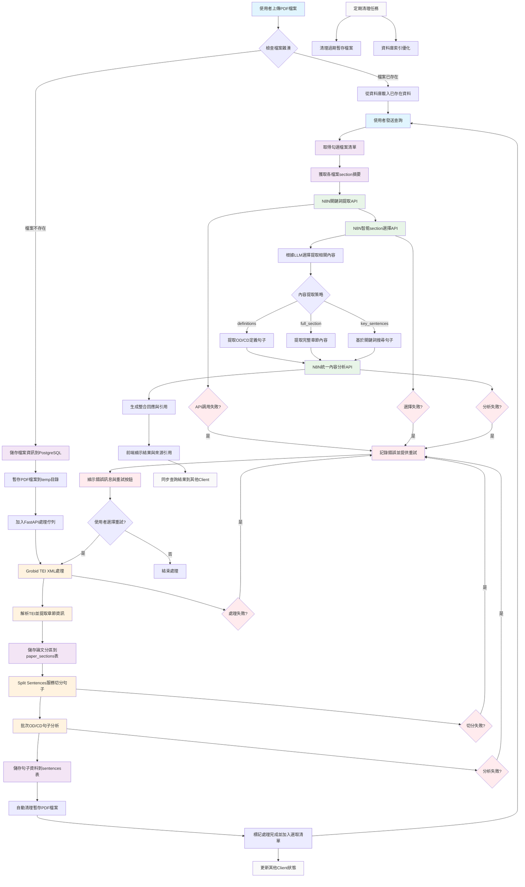
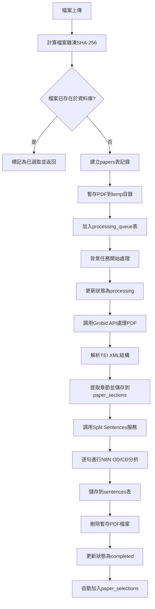
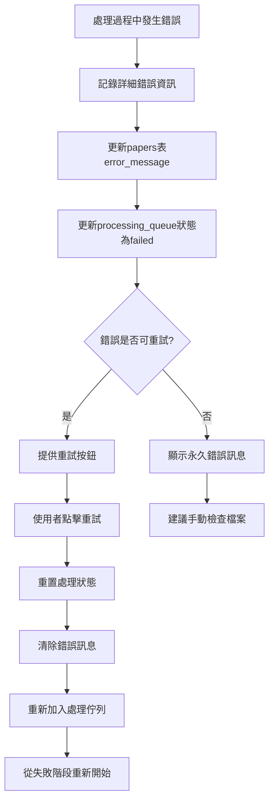
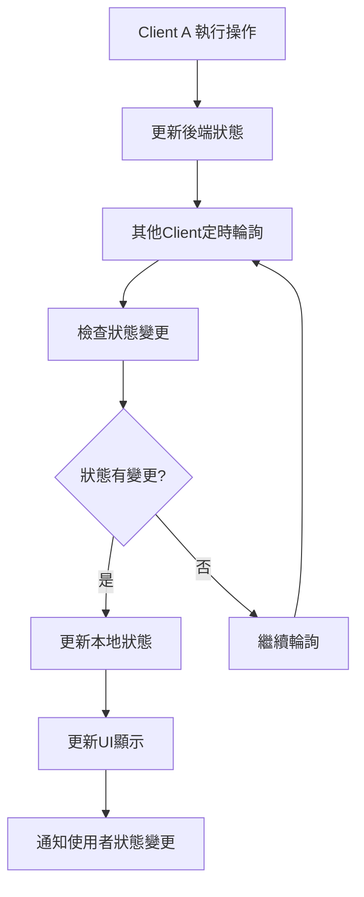
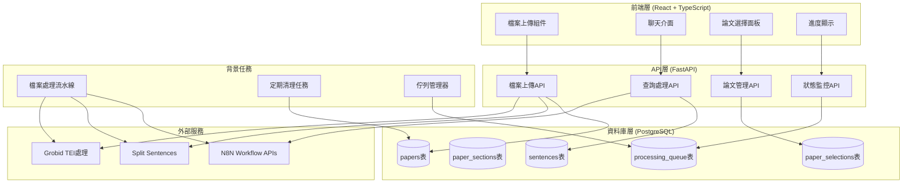
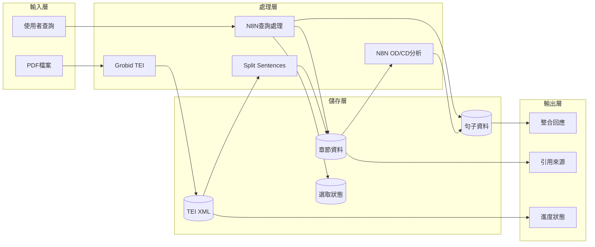
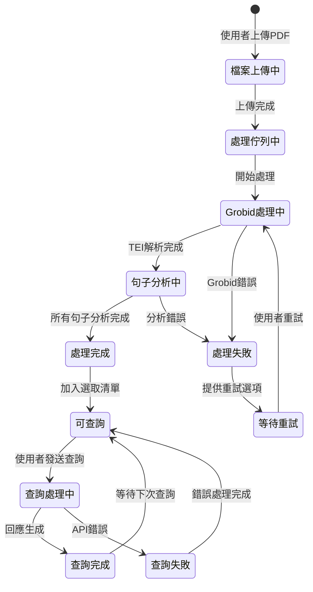

# 論文分析系統整體運作流程圖

## 系統概述
本系統是一個基於PostgreSQL資料庫的學術論文分析平台，整合Grobid進行文檔分區處理，支援多檔案橫向比較與深度分析。系統分為兩個主要工作流：**資料準備階段**和**使用者發問階段**。

## 整體系統流程圖



## 詳細子流程圖

### 1. 檔案處理流程 (資料準備階段)



### 2. 查詢處理流程 (使用者發問階段)

```mermaid
graph TD
    A2[使用者輸入查詢] --> B2[檢查已選取的論文清單]
    B2 --> C2{有選取的論文?}
    C2 -->|否| D2[提示選擇論文]
    C2 -->|是| E2[獲取papers section摘要]
    
    E2 --> F2[調用N8N關鍵詞提取API]
    F2 --> G2[調用N8N智能section選擇API]
    G2 --> H2[LLM分析並選擇相關sections]
    H2 --> I2[根據focus_type提取內容]
    
    I2 --> J2{focus_type判斷}
    J2 -->|definitions| K2[從sentences表提取OD/CD句子]
    J2 -->|full_section| L2[從paper_sections表提取完整內容]
    J2 -->|key_sentences| M2[基於關鍵詞搜尋相關句子]
    
    K2 --> N2[調用N8N統一內容分析API]
    L2 --> N2
    M2 --> N2
    N2 --> O2[生成整合回應]
    O2 --> P2[處理引用格式 [[ref:id]]]
    P2 --> Q2[前端顯示結果]
    Q2 --> R2[提供引用按鈕與來源資訊]
```

### 3. 錯誤處理與重試機制



### 4. 多Client同步機制



## 技術架構組件圖



## 資料流向圖



## 系統狀態轉換圖



## 總結

這個流程圖完整描述了論文分析系統的運作機制，包括：

1. **資料準備階段**：從檔案上傳到句子分析完成的完整流程
2. **查詢處理階段**：從使用者查詢到結果顯示的智能處理流程
3. **錯誤處理機制**：完善的錯誤捕獲、記錄和重試機制
4. **多Client同步**：支援多個瀏覽器視窗同時操作的同步機制
5. **技術架構**：清晰的分層架構和組件關係

系統採用PostgreSQL資料庫、Grobid TEI處理、N8N工作流API和FastAPI後端，提供了一個完整的學術論文分析解決方案。