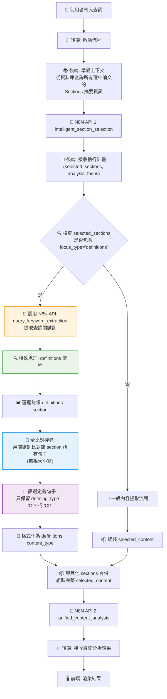
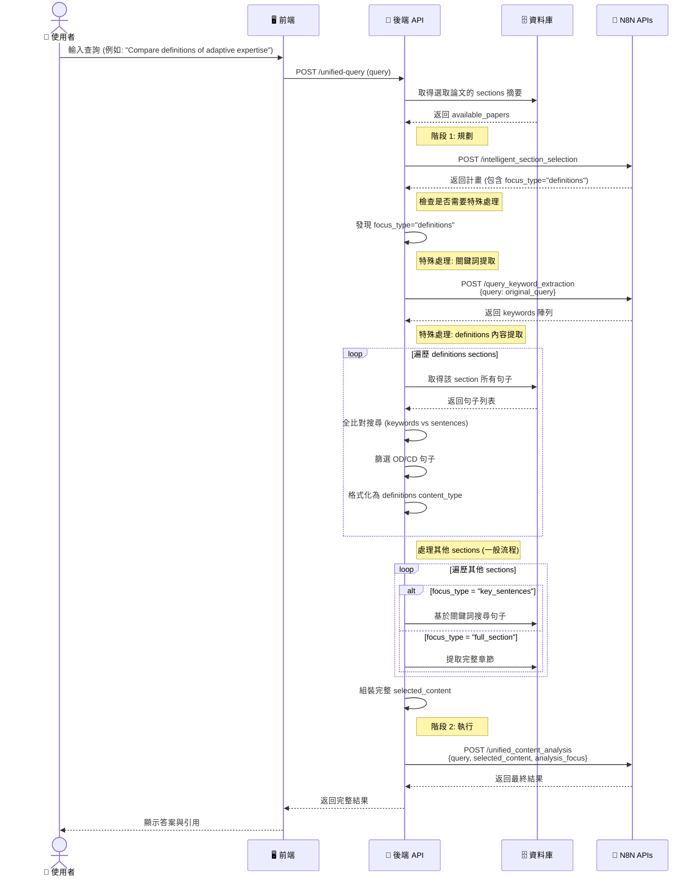

# 使用者訊息發送流程設計文件

## 系統概述

本文件描述論文分析系統中「使用者訊息發送流程」的完整設計，採用基於 N8N API 的兩階段處理架構，並包含針對 `definitions` focus_type 的特殊處理邏輯。

## 核心設計原則

### 1. 兩階段處理架構 (Two-Phase Processing)

**第一階段：規劃與範疇界定 (Planning & Scoping)**
- 由 `intelligent_section_selection` API 擔任「智慧路由器」角色
- 分析使用者查詢和可用論文資料，產生最佳執行計畫
- 決定要分析的 sections、focus_type 和 analysis_focus

**第二階段：執行與綜合分析 (Execution & Synthesis)**  
- 後端根據計畫精準提取所需內容
- 由 `unified_content_analysis` API 進行深度分析與綜合
- 產生包含引用標記的最終回覆

### 2. AI 驅動的靈活性 (AI-driven Flexibility)

- 拋棄僵硬的 if-else 規則，依賴 LLM 智能決策
- 根據查詢語意智能選擇章節和分析方式
- 支援多種 analysis_focus：`locate_info`、`understand_content`、`cross_paper`、`definitions`、`methods`、`results`、`comparison`

### 3. 最小化資料提取 (Data Minimization)

- 嚴格遵守第一階段規劃的 focus_type
- 只提取必要的內容，節省 Token 消耗
- 支援三種內容提取策略：`definitions`、`key_sentences`、`full_section`

## 主要流程圖

### 完整流程概覽



### 系統時序圖



## 詳細處理步驟

### 步驟1: 使用者提交查詢
- 使用者在聊天介面輸入查詢
- 前端驗證查詢內容並發送到後端

### 步驟2: 後端協調作業啟動
- 驗證輸入並確認已選取的論文清單
- 從資料庫查詢論文的 sections 摘要資訊

### 步驟3: 第一階段 - 智能規劃
**API調用：** `intelligent_section_selection`

**輸入格式：**
```json
{
  "query": "Compare definitions of adaptive expertise",
  "available_papers": [
    {
      "file_name": "smith2023.pdf", 
      "sections": [
        {
          "section_type": "introduction",
          "page_num": 2,
          "word_count": 950,
          "brief_content": "Adaptive expertise is defined as...",
          "od_count": 2,
          "cd_count": 1,
          "total_sentences": 38
        }
      ]
    }
  ]
}
```

**輸出格式：**
```json
{
  "selected_sections": [
    {
      "paper_name": "smith2023.pdf",
      "section_type": "introduction", 
      "focus_type": "definitions",
      "keywords": ["adaptive expertise", "definition"],
      "selection_reason": "Contains multiple definitions of adaptive expertise"
    }
  ],
  "analysis_focus": "definitions",
  "suggested_approach": "Compare and analyze different definitions"
}
```

### 步驟4: 內容提取階段

#### 4A. 特殊處理：definitions focus_type

當檢測到 `focus_type: "definitions"` 時：

1. **關鍵詞提取**
   ```json
   // API: query_keyword_extraction
   {
     "query": "Compare definitions of adaptive expertise"
   }
   
   // 返回
   [
     {
       "output": {
         "keywords": ["adaptive expertise", "definition", "compare"]
       }
     }
   ]
   ```

2. **全比對搜尋邏輯**
   ```typescript
   function findMatchingSentences(sentences: Sentence[], keywords: string[]): Sentence[] {
     return sentences.filter(sentence => {
       const sentenceText = sentence.sentence_text.toLowerCase();
       
       // 任意關鍵詞包含在句子中即為匹配
       return keywords.some(keyword => 
         sentenceText.includes(keyword.toLowerCase())
       );
     });
   }
   ```

3. **定義句子篩選**
   ```typescript
   const definitionSentences = matchedSentences.filter(
     sentence => sentence.defining_type === 'OD' || sentence.defining_type === 'CD'
   );
   ```

4. **格式化為 definitions content_type**
   ```json
   {
     "paper_name": "smith2023.pdf",
     "section_type": "introduction",
     "content_type": "definitions",
     "content": [
       {
         "text": "Adaptive expertise is the ability to flexibly apply knowledge to novel situations.",
         "type": "CD",
         "page_num": 2,
         "id": "smith2023_introduction_2_5",
         "reason": "This provides a conceptual definition without measurement details."
       },
       {
         "text": "We operationally define adaptive expertise as scoring above 80% on transfer tasks.",
         "type": "OD",
         "page_num": 3, 
         "id": "smith2023_introduction_3_12",
         "reason": "This provides measurable criteria for adaptive expertise."
       }
     ]
   }
   ```

#### 4B. 一般內容提取

對於其他 focus_type：
- `key_sentences`：基於關鍵詞搜尋句子
- `full_section`：提取完整章節內容

### 步驟5: 第二階段 - 統一分析

**API調用：** `unified_content_analysis`

**輸入格式：**
```json
{
  "query": "Compare definitions of adaptive expertise",
  "selected_content": [
    {
      "paper_name": "smith2023.pdf",
      "section_type": "introduction",
      "content_type": "definitions", 
      "content": [
        // definitions 陣列
      ]
    }
  ],
  "analysis_focus": "definitions"
}
```

**輸出格式：**
```json
{
  "response": "根據文獻分析，adaptive expertise 的定義呈現不同觀點 [[ref:smith2023_intro_2]]...",
  "references": [
    {
      "id": "smith2023_intro_2",
      "paper_name": "smith2023.pdf",
      "section_type": "introduction",
      "page_num": 2,
      "content_snippet": "Adaptive expertise is the ability to flexibly apply knowledge."
    }
  ],
  "source_summary": {
    "total_papers": 1,
    "papers_used": ["smith2023.pdf"],
    "sections_analyzed": ["introduction"],
    "analysis_type": "definition_comparison"
  }
}
```

### 步驟6: 結果呈現
- 後端將完整結果轉發給前端
- 前端解析 `[[ref:id]]` 標記為可點擊引用
- 顯示最終答案給使用者

## 核心演算法設計

### DefinitionsSectionProcessor 類別

```typescript
interface DefinitionsSectionProcessor {
  
  // 特殊處理 definitions focus_type
  async processDefinitionsSection(
    query: string, 
    section: SelectedSection,
    paperId: string
  ): Promise<SelectedContent> {
    
    // 1. 提取查詢關鍵詞
    const keywordResponse = await n8nAPI.extractKeywords(query);
    const keywords = keywordResponse[0].output.keywords;
    
    // 2. 取得該 section 的所有句子
    const allSentences = await db.getSentencesBySection(paperId, section.section_type);
    
    // 3. 全比對搜尋
    const matchedSentences = this.findMatchingSentences(allSentences, keywords);
    
    // 4. 篩選定義句子 (OD/CD)
    const definitionSentences = matchedSentences.filter(
      sentence => sentence.defining_type === 'OD' || sentence.defining_type === 'CD'
    );
    
    // 5. 格式化為 unified_content_analysis 所需格式
    return {
      paper_name: section.paper_name,
      section_type: section.section_type,
      content_type: "definitions",
      content: definitionSentences.map(sentence => ({
        text: sentence.sentence_text,
        type: sentence.defining_type,
        page_num: sentence.page_num,
        id: `${section.paper_name}_${section.section_type}_${sentence.page_num}_${sentence.sentence_order}`,
        reason: sentence.analysis_reason
      }))
    };
  }
  
  // 全比對搜尋邏輯
  private findMatchingSentences(sentences: Sentence[], keywords: string[]): Sentence[] {
    return sentences.filter(sentence => {
      const sentenceText = sentence.sentence_text.toLowerCase();
      
      // 任意關鍵詞包含在句子中即為匹配
      return keywords.some(keyword => 
        sentenceText.includes(keyword.toLowerCase())
      );
    });
  }
}
```

### 查詢處理協調器

```typescript
class UnifiedQueryProcessor {
  
  async processQuery(query: string, paperIds: string[]): Promise<QueryResult> {
    
    // 1. 準備上下文
    const availablePapers = await this.prepareAvailablePapers(paperIds);
    
    // 2. 第一階段：智能規劃
    const planResult = await this.n8nAPI.intelligentSectionSelection({
      query,
      available_papers: availablePapers
    });
    
    // 3. 內容提取階段
    const selectedContent = await this.extractContent(query, planResult.selected_sections);
    
    // 4. 第二階段：統一分析
    const analysisResult = await this.n8nAPI.unifiedContentAnalysis({
      query,
      selected_content: selectedContent,
      analysis_focus: planResult.analysis_focus
    });
    
    return analysisResult;
  }
  
  private async extractContent(query: string, selectedSections: SelectedSection[]): Promise<SelectedContent[]> {
    const results = [];
    
    for (const section of selectedSections) {
      if (section.focus_type === 'definitions') {
        // 特殊處理 definitions
        const definitionsContent = await this.definitionsProcessor.processDefinitionsSection(
          query, section, section.paper_name
        );
        results.push(definitionsContent);
      } else {
        // 一般處理流程
        const generalContent = await this.generalProcessor.processGeneralSection(
          section, section.paper_name
        );
        results.push(generalContent);
      }
    }
    
    return results;
  }
}
```

## 系統優勢

### 1. 智能化決策
- ✅ LLM 基於上下文智能選擇最佳 sections
- ✅ 自動決定最適合的分析策略和內容提取方式
- ✅ 避免僵硬的規則導致的誤判

### 2. 精準內容提取
- ✅ 針對 definitions 查詢的特殊優化處理
- ✅ 關鍵詞驅動的全比對搜尋
- ✅ 只提取真正相關的 OD/CD 定義句子

### 3. 高效資源利用
- ✅ 最小化傳遞給分析 API 的資料量
- ✅ 減少 Token 消耗和處理時間
- ✅ 支援批次處理和並行執行

### 4. 可追溯引用
- ✅ 完整的 `[[ref:id]]` 引用標記系統
- ✅ 精確的來源追溯到句子級別
- ✅ 結構化的引用資訊便於前端渲染

## 擴展性設計

### 新增 focus_type 支援
系統設計允許輕鬆新增新的 focus_type：
1. 在 `extractContent` 方法中新增條件分支
2. 實作對應的處理器類別
3. 更新 API 文檔和測試用例

### 新增 analysis_focus 支援
N8N API 支援新的 analysis_focus 無需修改後端程式碼，只需：
1. 更新 API 文檔
2. 在 N8N workflow 中新增對應的分析指令

## 測試用例

### 測試案例1: 定義比較查詢
**輸入：** "Compare definitions of adaptive expertise across papers"
**預期：** focus_type="definitions", 觸發特殊處理流程

### 測試案例2: 方法論查詢  
**輸入：** "What methods are used to measure creativity?"
**預期：** focus_type="key_sentences", 使用一般處理流程

### 測試案例3: 跨論文比較
**輸入：** "Compare research approaches across studies"
**預期：** analysis_focus="cross_paper", 生成比較表格

## 總結

本設計提供了一個智能、高效且可擴展的使用者訊息發送處理流程，特別針對定義相關查詢進行了優化。通過兩階段處理架構和 AI 驅動的決策機制，系統能夠為使用者提供精準、相關且可追溯的分析結果。