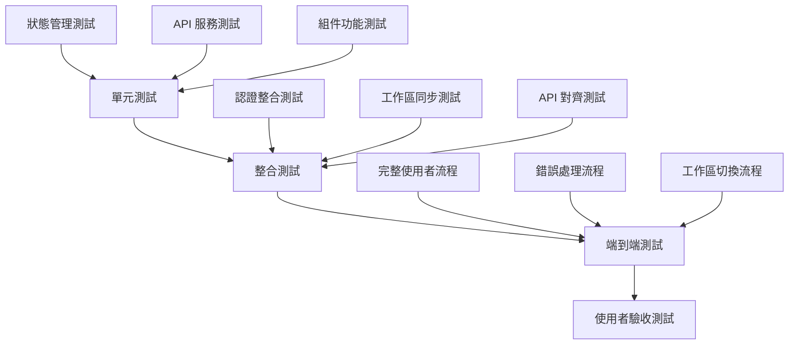

# 🚀 系統修復任務總覽與實施計劃

## 📋 修復計劃概述

基於全方位 Backlog 完整性驗證分析，本文檔提供完整的修復任務規劃、優先級排序和實施時程，旨在一勞永逸地解決持續 debug 問題，建立穩定可靠的開發基礎。

### 🎯 修復目標
- 解決 2 個 Critical Issues，消除系統核心功能斷點
- 修復 2 個 High Priority Issues，完善核心功能體驗
- 處理 2 個 Medium Priority Issues，減少技術債務
- 建立穩定的端到端測試流程

## 🔴 Critical Issues 修復計劃

### CI-01: 核心業務流程整合修復
- **修復文檔**: [CI-01_核心業務流程整合修復指南.md](./CI-01_核心業務流程整合修復指南.md)
- **預估工期**: 1.5-2 週
- **關鍵修復點**:
  - 認證與工作區狀態整合
  - 檔案上傳流程工作區化
  - 用戶查詢流程工作區化
- **成功標準**: 用戶可以完整執行「登入→選擇工作區→上傳檔案→進行查詢」流程

### CI-02: 認證與工作區狀態管理整合
- **修復文檔**: [CI-02_認證工作區整合修復指南.md](./CI-02_認證工作區整合修復指南.md)
- **預估工期**: 1 週
- **關鍵修復點**:
  - 建立統一的應用狀態管理
  - 創建平滑的初始化流程
  - 實現錯誤處理和重試機制
- **成功標準**: 用戶登入後自動完成工作區初始化，無需手動操作

## 🟡 High Priority Issues 修復計劃

### HI-01: API 契約與前端實作對齊
- **修復文檔**: [HI-01_API契約對齊修復指南.md](./HI-01_API契約對齊修復指南.md)
- **預估工期**: 3-4 天
- **關鍵修復點**:
  - 建立完整的工作區 API 服務層
  - 更新 TypeScript 類型定義
  - 遷移現有組件到新 API
- **成功標準**: 前端完全使用工作區範圍的 API，不再調用舊端點

### HI-02: 資料庫遷移與模型一致性優化
- **預估工期**: 2-3 天
- **關鍵修復點**:
  - 驗證所有資料庫關聯的正確性
  - 優化查詢索引以支援工作區隔離
  - 確保級聯刪除的安全性
- **成功標準**: 資料庫操作穩定且效能良好，資料隔離完全生效

## 🟢 Medium Priority Issues 修復計劃

### MI-01: 狀態管理架構統一
- **預估工期**: 2-3 天
- **關鍵修復點**:
  - 逐步遷移舊的全域狀態到工作區狀態
  - 建立一致的狀態管理模式
  - 清理冗餘的狀態管理程式碼
- **成功標準**: 狀態管理架構統一，無冗餘或衝突的狀態系統

### MI-02: 錯誤處理與使用者體驗優化
- **預估工期**: 1-2 天
- **關鍵修復點**:
  - 統一錯誤處理策略
  - 改善錯誤訊息的友善性
  - 加強載入狀態和進度回饋
- **成功標準**: 錯誤處理一致且友善，使用者體驗流暢

## 📅 整體實施時程規劃

### 第一階段：核心功能修復 (3 週)
```
Week 1: CI-02 認證工作區整合
├── Day 1-2: 統一狀態管理架構設計
├── Day 3-4: 應用結構重構
└── Day 5: 測試與優化

Week 2: CI-01 核心業務流程整合 (第一部分)
├── Day 1-2: 認證與工作區狀態整合
├── Day 3-4: 檔案上傳流程工作區化
└── Day 5: 初步測試

Week 3: CI-01 核心業務流程整合 (第二部分)
├── Day 1-2: 用戶查詢流程工作區化
├── Day 3: 整合測試
└── Day 4-5: 端到端測試與修復
```

### 第二階段：API 對齊與優化 (1 週)
```
Week 4: HI-01 API 契約對齊 + 資料庫優化
├── Day 1: TypeScript 類型定義更新
├── Day 2: 工作區 API 服務建立
├── Day 3: 組件遷移到新 API
├── Day 4: 資料庫索引優化
└── Day 5: 整合測試與驗證
```

### 第三階段：技術債務清理 (1 週)
```
Week 5: MI-01 & MI-02 狀態管理與體驗優化
├── Day 1-2: 狀態管理架構統一
├── Day 3: 錯誤處理優化
├── Day 4: 使用者體驗改善
└── Day 5: 最終測試與文檔更新
```

## 🧪 測試策略

### 階段性測試


### 核心測試場景
1. **新用戶註冊流程**: 註冊→登入→創建工作區→上傳檔案→查詢
2. **現有用戶流程**: 登入→選擇工作區→上傳檔案→查詢
3. **工作區切換流程**: 在多個工作區間切換並驗證資料隔離
4. **錯誤恢復流程**: 網路錯誤、認證失效、API 錯誤的處理
5. **邊界條件測試**: 大檔案上傳、長時間查詢、並發操作

### 測試檔案準備
- **標準測試檔案**: `/split_sentences/app/tests/sample_test.pdf`
- **大檔案測試**: 建立 45MB 左右的測試 PDF
- **多格式測試**: 準備不支援格式的檔案進行錯誤測試
- **多工作區測試**: 準備不同主題的測試檔案

## 🔧 技術實施細節

### 開發環境準備
```bash
# 1. 確保開發環境同步
git checkout document-adjust
git pull origin document-adjust

# 2. 安裝依賴
cd pure_front
npm install

# 3. 啟動開發服務
npm run dev

# 4. 啟動後端服務
cd backend
python -m uvicorn main:app --reload --port 28001

# 5. 確保資料庫服務運行
docker-compose up -d postgres
```

### 程式碼品質要求
- **TypeScript 嚴格模式**: 所有新程式碼必須通過 TypeScript 嚴格檢查
- **ESLint 規則**: 遵循專案 ESLint 配置
- **程式碼覆蓋率**: 新增程式碼的測試覆蓋率需達到 80% 以上
- **效能要求**: API 回應時間 < 2 秒，頁面載入時間 < 3 秒

### Git 工作流程
```bash
# 每個修復任務使用獨立分支
git checkout -b fix/CI-01-core-workflow-integration
# 開發完成後提交
git add .
git commit -m "fix(CI-01): integrate authentication with workspace state management"
# 推送並創建 Pull Request
git push origin fix/CI-01-core-workflow-integration
```

## 📊 進度追蹤

### 關鍵績效指標 (KPI)
```typescript
interface FixProgress {
  // 功能完成度
  criticalIssuesResolved: number; // 目標: 2/2
  highPriorityIssuesResolved: number; // 目標: 2/2
  
  // 測試覆蓋率
  unitTestCoverage: number; // 目標: >80%
  e2eTestsPassing: number; // 目標: 100%
  
  // 效能指標
  apiResponseTime: number; // 目標: <2s
  pageLoadTime: number; // 目標: <3s
  
  // 使用者體驗
  errorRate: number; // 目標: <1%
  userFlowCompletionRate: number; // 目標: >95%
}
```

### 每日檢查清單
```markdown
## 每日進度檢查

### 功能開發
- [ ] 當日計劃任務完成
- [ ] 新增程式碼通過 TypeScript 檢查
- [ ] 單元測試撰寫完成
- [ ] 程式碼審查完成

### 整合測試
- [ ] 與現有功能整合無問題
- [ ] API 端點正常回應
- [ ] 前後端資料格式一致
- [ ] 錯誤處理按預期運作

### 使用者體驗
- [ ] 載入狀態顯示正確
- [ ] 錯誤訊息友善
- [ ] 操作流程順暢
- [ ] 視覺回饋適當
```

## 🚨 風險管理

### 高風險點識別
1. **認證整合風險**: JWT token 管理可能影響現有登入功能
2. **資料遷移風險**: 工作區化可能影響現有用戶資料
3. **API 變更風險**: 新 API 可能與前端期望不符
4. **效能風險**: 新的狀態管理可能影響系統效能

### 風險緩解策略
```typescript
// 1. 漸進式遷移策略
const useMigrationSafeApi = () => {
  // 提供舊新 API 的並行支援
  return {
    useNewApi: FEATURE_FLAGS.useWorkspaceApi,
    fallbackToOldApi: !FEATURE_FLAGS.useWorkspaceApi
  };
};

// 2. 回滾計劃
const rollbackPlan = {
  level1: "重置到修復前的 git commit",
  level2: "使用 feature flag 關閉新功能",
  level3: "資料庫回滾到備份點"
};

// 3. 監控指標
const monitoringMetrics = {
  errorRate: "< 1%",
  responseTime: "< 2s",
  userSatisfaction: "> 95%"
};
```

### 回滾機制
```bash
# Git 層級回滾
git revert <commit-hash>

# 功能開關回滾
export ENABLE_WORKSPACE_FEATURES=false

# 資料庫回滾
docker exec postgres pg_restore /backup/pre_fix_backup.sql
```

## 📈 成功驗證標準

### 技術驗證
- [ ] 所有 Critical Issues 狀態為「已解決」
- [ ] 所有自動化測試通過 (單元測試、整合測試、E2E 測試)
- [ ] 程式碼覆蓋率達到 80% 以上
- [ ] TypeScript 編譯無錯誤和警告
- [ ] ESLint 檢查無問題

### 功能驗證
- [ ] 完整的用戶流程可以順利執行
  - 登入→工作區選擇→檔案上傳→查詢→結果顯示
- [ ] 工作區間資料完全隔離
- [ ] 錯誤處理機制健全
- [ ] 使用 `sample_test.pdf` 的端到端測試通過

### 效能驗證
- [ ] 頁面載入時間 < 3 秒
- [ ] API 回應時間 < 2 秒
- [ ] 檔案上傳進度回饋正常
- [ ] 工作區切換延遲 < 1 秒

### 使用者體驗驗證
- [ ] 新用戶可以不看文檔完成基本操作
- [ ] 錯誤訊息清晰且可操作
- [ ] 載入狀態有適當的視覺回饋
- [ ] 操作結果有明確的成功/失敗提示

## 📚 相關文檔

### 修復指南文檔
- [CI-01: 核心業務流程整合修復指南](./CI-01_核心業務流程整合修復指南.md)
- [CI-02: 認證工作區整合修復指南](./CI-02_認證工作區整合修復指南.md)
- [HI-01: API 契約對齊修復指南](./HI-01_API契約對齊修復指南.md)

### 技術參考文檔
- [系統架構文檔](../system_architecture.md)
- [API 文檔](../api_documentation.md)
- [資料庫設計文檔](../database_schema.md)

### 原始 Backlog 文檔
- [前端 Backlog 總覽](../backlog/frontend/00_FRONTEND_INTEGRATION_OVERVIEW.md)
- [後端 Backlog 總覽](../backlog/backend/00_BACKLOG_OVERVIEW.md)
- [資料庫 Backlog 總覽](../backlog/database/00_BACKLOG_OVERVIEW.md)

## 🤝 團隊協作

### 角色與責任
- **前端負責人**: 負責 CI-01, CI-02, HI-01 的前端部分
- **後端負責人**: 負責 API 端點驗證和 HI-02 的資料庫優化
- **QA 負責人**: 負責測試計劃執行和品質驗證
- **專案經理**: 負責進度追蹤和風險管控

### 溝通機制
- **每日站會**: 分享進度、問題和需要協助的事項
- **技術討論**: 重要技術決策需要團隊討論確認
- **程式碼審查**: 所有修復程式碼需要至少一人審查
- **測試回報**: 測試結果需要及時回報和記錄

### 問題升級機制
```
Level 1: 技術問題 → 團隊內討論解決
Level 2: 架構問題 → 技術負責人決定
Level 3: 專案風險 → 專案經理介入
Level 4: 業務影響 → 利害關係人會議
```

## 📞 聯絡資訊

### 技術支援
- **前端技術問題**: [前端負責人聯絡方式]
- **後端技術問題**: [後端負責人聯絡方式]
- **資料庫問題**: [資料庫管理員聯絡方式]

### 緊急聯絡
- **系統故障**: [緊急聯絡電話]
- **資料問題**: [資料恢復負責人]
- **使用者影響**: [客服負責人]

---

**💡 提醒**: 本修復計劃採用漸進式實施策略，確保系統穩定性的同時完成功能改進。所有修復任務都有完整的測試和回滾機制，最大限度降低風險。 